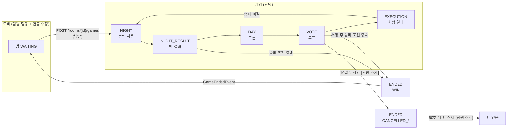

# 게임 진행 파트 코드 리뷰 자료

작성: 원우 (klik075) · 기준: `project_server` `origin/dev` **`c10b44e`** (2026-10-06, "feat(auth): 구글/카카오 소셜 로그인 구현 및 User 프로필 도메인 패키지 분리")

## 10/6 갱신 내용

처음 작성한 기준(`5ec17e8`, 10/1) 이후 게임 코드에 팀원 커밋이 들어와서 문서를 고쳤습니다. 표시 규칙:

- **[팀원 추가]** 표시가 붙은 부분은 내 커밋이 아닙니다. 리뷰 때 "이후 이렇게 바뀌었다"로 설명하면 됩니다.
- 표시가 없는 부분은 내가 작성한 구조이거나, 팀원 커밋 후에도 그대로인 부분입니다.

| 커밋 | 작성자 | 문서에 준 영향 |
| --- | --- | --- |
| `50e9431` 끝나지 않는 게임 방지 | StopDragon | 연결 끊김 사망 처리, 10일 무사망·오류 시 **게임 취소**, 승리 조건(앵무새 접선) 변경 → 01, 03, 05, 06, 07, 08 |
| `3705f56` 직업 배정 방식 추가 | StopDragon | 추천·커스텀·랜덤 배정, `GET /api/v1/role-setup/options` → 02 |
| `348f4a6` 직업별 능력 시스템 메시지 | kimdandy | 해적 전용 안내(`PirateNoticeEvent`), 차단 결과(`BLOCK`/`BLOCKED`) → 03, 04 |
| `1a7da64`, `bbf5d23`, `1454385` 유령·밤 채팅 | kimdandy | 사망자 채팅, 밤에는 해적만 채팅 → 05 |
| `c10b44e` 소셜 로그인 + User 패키지 분리 | DoroNyong | `CurrentUserResolver`, `UserStats*`가 `member` → `user` 패키지로 이동 → 07, 08 |

## 내가 맡은 범위

게임의 전체 흐름 중 **게임 시작부터 기존 방으로 복귀까지**입니다. 회원·로비·채팅은 다른 팀원 담당이고, 게임을 붙이기 위해 로비 코드 일부를 수정했습니다.

| 순서 | 흐름 | 문서 |
| --- | --- | --- |
| 1 | 게임 시작 (로비 연동: 방 상태, 방 잠금, 시작 API, 장애 복구) | [01_게임시작_로비연동.md](01_게임시작_로비연동.md) |
| 2 | 플레이어 역할 배정 | [02_역할배정.md](02_역할배정.md) |
| 3 | 밤 상태 · 시민팀/마피아팀 능력 사용 | [03_밤_능력사용.md](03_밤_능력사용.md) |
| 4 | 밤 결과 공개 | [04_밤결과공개.md](04_밤결과공개.md) |
| 5 | 낮 상태 · 투표 상태 | [05_낮_투표.md](05_낮_투표.md) |
| 6 | 처형 처리 · 승리 조건 검사 · 밤 반복 | [06_처형_승리조건_반복.md](06_처형_승리조건_반복.md) |
| 7 | 게임 종료(승리·취소) · 기존 방으로 복귀 | [07_게임종료_방복귀.md](07_게임종료_방복귀.md) |
| 공통 | 페이즈 타이머, 연결 끊김 검사, 동시성, 채팅 안내, 예외 | [08_공통_타이머_동시성_예외.md](08_공통_타이머_동시성_예외.md) |

각 문서는 같은 순서로 썼습니다: **한눈에 보기 → 호출 흐름 → 핵심 코드 → 규칙/예외 → 리뷰 포인트**.

## 전체 그림



- 페이즈 전환은 **서버가 타이머로** 합니다. 클라이언트가 "다음 단계로" 요청하는 API는 없습니다.
- 밤과 투표는 **전원이 제출하면** 타이머를 기다리지 않고 바로 넘어갑니다.
- 승리 조건은 **밤 판정 직후**와 **처형 직후**에 검사합니다. 연결 끊김으로 사망자가 생겼을 때도 검사합니다 [팀원 추가].
- **[팀원 추가]** 게임이 승패 없이 끝나는 **취소**가 생겼습니다(모두 연결 끊김, 10일 무사망, 서버 오류). 취소된 게임은 전적에 반영하지 않고, 60초 뒤 방이 삭제됩니다.
- 게임 상태는 서버 메모리(`InMemoryGameRepository`)에, 방은 Redis에 있습니다.

## 패키지 지도

| 패키지 | 역할 | 주요 클래스 |
| --- | --- | --- |
| `lobby` (연동 수정) | 방 상태, 시작 API, 방 복귀, 이탈자 제외·취소 방 삭제 | `Room`, `RoomService`, `RoomLockManager`, `RoomGameListener`, `RoomController` |
| `game` | 게임 생성, 역할 배정, 페이즈 진행, 승리 판정, 연결 끊김 검사 | `GameService`, `GameFlowService`, `RoleAssigner`, `WinConditionChecker`, `InactivePlayerMonitor`, `Game`, `GamePlayer` |
| `night` | 밤 능력 제출·넘기기, 밤 판정, 밤 결과 | `NightService`, `NightActionResolver`, `NightResult`, `PrivateReport` |
| `vote` | 투표, 처형 | `VoteService`, `VoteResolver`, `ExecutionResult` |
| `common` | 설정, 이벤트, 예외 | `GameConfig`, `GamePhaseProperties`, `RoomNoticeEvent`, `PirateNoticeEvent`, `GlobalExceptionHandler` |
| `user` (연동, 10/6에 `member`에서 분리) | JWT → userId, 전적 저장 | `CurrentUserResolver`, `UserStatsListener`, `UserStatsService` |

## 모듈 사이의 의존 방향

```mermaid
flowchart LR
    lobby -- "gameService.startGame()<br/>gameService.keepsRoomInGame()" --> game
    game -- "GameEndedEvent<br/>PlayersDepartedEvent<br/>CancelledGameExpiredEvent" -.-> lobby
    game -- "GameEndedEvent" -.-> user
    game -- "RoomNoticeEvent<br/>PirateNoticeEvent" -.-> chat
    lobby -- "RoomNoticeEvent<br/>RoomDeletedEvent" -.-> chat
```

- 실선: 직접 호출. 점선: Spring 이벤트(`ApplicationEventPublisher`).
- **게임은 로비·회원·채팅을 모릅니다.** 이벤트만 발행하고 각 모듈이 구독합니다. 팀원이 연결 끊김·취소를 추가할 때도 이 구조를 그대로 써서 이벤트 2개(`PlayersDepartedEvent`, `CancelledGameExpiredEvent`)만 늘었습니다.

## 게임 API 한눈에 보기

모두 `Authorization: Bearer {accessToken}` 필요. "나"는 토큰으로 판단합니다(`CurrentUserResolver`: sub=memberId → User.id = playerId).

| 메서드 · 경로 | 페이즈 | 설명 |
| --- | --- | --- |
| `POST /api/v1/rooms/{roomId}/games` | - | 게임 시작 (방장) |
| `GET /api/v1/games/{gameId}` | 전체 | 상태 polling (phase, day, phaseEndsAt, serverTime, phaseVersion, 생존자, winner, **endReason**). **접속 기록도 겸함** [팀원 추가] |
| `GET /api/v1/games/{gameId}/me` | 전체 | 내 직업, 능력, 남은 횟수, 해적 동료 |
| `POST /api/v1/games/{gameId}/night-actions` | NIGHT | 밤 능력 제출 `{targetId}` |
| `POST /api/v1/games/{gameId}/night-actions/skip` | NIGHT | 밤 능력 넘기기 |
| `GET /api/v1/games/{gameId}/night-result` | 밤 판정 후 | 사망자 + 내 개인 결과 |
| `POST /api/v1/games/{gameId}/votes` | VOTE | 투표 `{targetId}` |
| `GET /api/v1/games/{gameId}/execution-result` | 처형 후 | 처형 결과, 득표 |
| `GET /api/v1/games/{gameId}/result` | ENDED | 승리 진영, **endReason**, 전원 실제 직업 (종료 후 60초까지) |
| `GET /api/v1/role-setup/options` | - | 직업 배정 설정 화면용 정보 [팀원 추가] |
| `POST /api/v1/games` · `GET .../dev/roles` | - | **local 프로필 전용** 테스트 API (`DevGameController`). `roleSetup` 선택 입력 [팀원 추가] |

## 설정값 (`mafia.phase.*`, 초)

| 키 | local | prod | 비고 |
| --- | --- | --- | --- |
| `night-seconds` | 300 | 30 | |
| `night-result-seconds` | 5 | 5 | |
| `day-seconds` | 5 | 60 | |
| `vote-seconds` | 300 | 30 | |
| `execution-seconds` | 5 | 5 | |
| `ended-retention-seconds` | 60 | 60 | 종료 후 결과 조회 가능 시간 |
| `inactive-timeout-seconds` | **0 (끔)** | 60 | [팀원 추가] 상태 조회가 이 시간 없으면 연결 끊김. Postman은 1초 polling을 안 해서 local은 꺼 둠 |
| `inactive-check-seconds` | 5 | 5 | [팀원 추가] 연결 끊김 검사 주기 |
| `max-days-without-death` | 10 | 10 | [팀원 추가] 연속 무사망 일수가 이만큼이면 취소 |

> 배포 주의 (`c10b44e`): prod 프로필은 이제 환경변수 **`GOOGLE_CLIENT_ID`가 없으면 서버가 시작되지 않습니다.** EC2의 `.env`에 추가해야 합니다.

## 최신 코드와 맞추기

```bash
git fetch origin
git log origin/dev --author=klik075 --oneline --no-merges        # 내 커밋 목록
git log c10b44e..origin/dev --oneline --no-merges                 # 이 문서 이후 새 커밋
git diff c10b44e origin/dev --stat -- src/main/java/com/WhoisntCitizen_server/{game,lobby,night,vote}
```

## 테스트 코드

| 테스트 | 확인하는 것 |
| --- | --- |
| `GameServiceStateTest` | 게임 생성, 상태 조회, 접속 기록 |
| `RoleAssignerCompositionTest`, `RoleAssignerMonkeyTest` | 추천 구성, 원숭이 위장 |
| `RoleAssignerSetupTest`, `GameServiceRoleSetupTest`, `RoleSetupControllerTest` | [팀원 추가] 커스텀·랜덤 배정, 설정 검증 |
| `GameNightActionTest`, `NightSkipTest`, `ParrotContactTest` | 밤 제출 검증, 넘기기, 접선 |
| `NightActionResolverTest`, `NightBlockAndWatchTest`, `MonkeyTest` | 밤 판정 순서, 차단 결과 |
| `NightServiceContactTest`, `NightServiceSkipTest` | 조기 판정 조건, 해적 안내 |
| `VoteServiceExecutionResultTest` | 처형 결과 응답 |
| `WinConditionCheckerTest` | [팀원 추가] 앵무새 접선 여부에 따른 승리 판정 |
| `GameDepartTest`, `GameFlowServiceEndlessGameTest`, `RoomServiceEndlessGameTest` | [팀원 추가] 연결 끊김, 무사망 취소, 오류 취소, 방 정리 |
| `UserStatsListenerTest` | [팀원 추가] 취소된 게임 전적 미반영 |
| `GameApiJsonContractTest` | Unity와 맞춘 JSON 필드 이름 |
