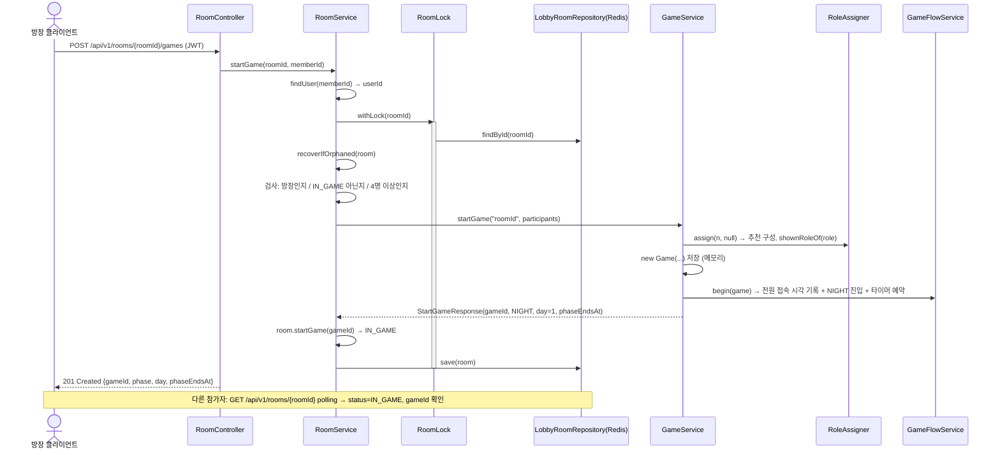

# 1. 게임 시작 (로비 연동)

> 10/6 갱신 (`c10b44e`): `isGameActive` → `keepsRoomInGame` 이름·조건 변경, 연결 끊김·취소 처리용 `removeDepartedPlayers`, `deleteRoomOfCancelledGame` 추가 [팀원 추가 · StopDragon `50e9431`]. 게임 시작 자체의 흐름은 그대로입니다.

## 한눈에 보기

- 방장이 `POST /api/v1/rooms/{roomId}/games`를 호출하면 방 참가자로 게임을 만들고, 방을 `IN_GAME`으로 바꾼 뒤 `gameId`를 돌려줍니다.
- 다른 참가자는 `GET /api/v1/rooms/{roomId}`를 polling하다가 `status=IN_GAME`과 `gameId`를 보고 게임 화면으로 들어갑니다.
- 이 기능을 위해 로비(팀원 담당) 코드에 아래를 추가했습니다.

| 추가한 것 | 파일 | 이유 |
| --- | --- | --- |
| 방 상태 `status`(WAITING / IN_GAME), `gameId` | `Room`, `RoomStatus`, 응답 DTO | 참가자가 게임 시작과 gameId를 알아야 함 |
| 방별 잠금 | `RoomLock` (구현 `LocalRoomLock`, 예전 `RoomLockManager`) | 입장·나가기·시작·복귀가 동시에 일어날 때 덮어쓰기 방지 |
| 게임 중 입장·나가기 금지 | `RoomService.joinRoom/leaveRoom` | 게임은 시작 시 명단을 고정하므로 |
| 방 단건 조회 API | `RoomController.getRoom`, `RoomDetailResponseDto` | 대기 화면 polling용 |
| 게임 시작 API | `RoomController.startGame`, `RoomService.startGame` | 방 → 게임 연결 |
| 고아 방 복구 | `RoomService.recoverIfOrphaned` | 서버 재시작으로 게임이 사라진 방을 WAITING으로 |
| 인원 규칙 공유 | `RoomService.MIN/MAX_PLAYERS = RoleAssigner.*` | 규칙을 한 곳에서 관리 |

팀원이 이후 추가한 것 [팀원 추가]

| 추가된 것 | 파일 | 이유 |
| --- | --- | --- |
| 연결 끊긴 플레이어를 방에서 제외 | `RoomService.removeDepartedPlayers` | 게임 중 앱을 끈 사람이 방에 유령으로 남지 않도록 |
| 취소된 게임의 방 삭제 | `RoomService.deleteRoomOfCancelledGame` | 취소된 게임은 대기실로 돌아가지 않고 방을 없앰 |
| 방 삭제 이벤트 | `RoomDeletedEvent` | 방이 지워질 때 채팅 기록(Redis)도 지우도록 |

## 호출 흐름



## 핵심 코드

### `RoomService.startGame`

```java
public StartGameResponse startGame(Long roomId, Long memberId) {
    Long userId = findUser(memberId).getId();          // DB 조회는 잠금 밖에서

    return roomLockManager.withLock(roomId, () -> {
        Room room = findRoom(roomId);
        recoverIfOrphaned(room);                         // 게임이 사라진 IN_GAME 방이면 먼저 WAITING으로

        if (!userId.equals(room.getHostUserId())) throw new IllegalStateException("방장만 게임을 시작할 수 있습니다.");
        if (room.isInGame()) throw new IllegalStateException("이미 게임이 진행 중인 방입니다.");
        if (room.getPlayers().size() < MIN_PLAYERS) throw new IllegalStateException("... 최소 4명 ...");

        List<GameParticipant> participants = room.getPlayers().stream()
                .map(p -> new GameParticipant(p.getUserId(), p.getNickname()))
                .toList();

        // 게임을 먼저 만들고, 성공했을 때만 방 상태를 바꾼다.
        StartGameResponse started = gameService.startGame(String.valueOf(roomId), participants);
        room.startGame(started.gameId());
        roomRepository.save(room);
        return started;
    });
}
```

포인트

- **순서가 중요합니다.** 게임 생성이 실패하면(예: 인원 규칙 위반) 예외가 나서 방은 WAITING 그대로 남습니다. 방을 먼저 IN_GAME으로 저장했다면 실패 시 되돌리는 코드가 필요했을 것입니다.
- 게임 쪽에 넘기는 것은 `GameParticipant(userId, nickname)` 목록뿐입니다. **게임은 Room 클래스를 모릅니다.**
- 방의 `userId`(User.id)가 그대로 게임의 `playerId`가 됩니다. 그래서 게임 API에서 토큰으로 찾은 userId로 본인 확인이 됩니다.
- 준비(ready) 상태는 검사하지 않습니다. 준비 API가 아직 없습니다(4단계 보류).
- 방에서 시작하는 게임은 아직 항상 **추천 구성**입니다. 직업 배정 설정(커스텀·랜덤)을 받는 `startGame(roomId, participants, roleSetup)`은 게임 쪽에 준비돼 있지만, 방에 설정을 저장하는 API가 dev에 없어 로비가 호출하지 않습니다(02번 문서).

### `Room`에 추가한 상태

```java
private RoomStatus status = RoomStatus.WAITING;  // 필드 기본값: 예전 Redis 데이터(status 없음)도 WAITING으로 읽힘
private String gameId;                            // 진행 중인 게임 id, 대기 중이면 null

public void startGame(String gameId) {            // WAITING → IN_GAME
    if (isInGame()) throw new IllegalStateException("이미 게임이 진행 중인 방입니다.");
    this.status = RoomStatus.IN_GAME;
    this.gameId = gameId;
}

public void finishGame() {                         // IN_GAME → WAITING (7번 문서)
    this.status = RoomStatus.WAITING;
    this.gameId = null;
    players.forEach(RoomPlayer::resetReady);
}
```

- `@JsonIgnoreProperties(ignoreUnknown = true)`: `isInGame()` 같은 getter가 JSON에 `inGame`으로 저장돼서, 읽을 때 무시하도록 했습니다.

### `RoomLock` (방별 잠금) — 10/8 `RoomLockManager`에서 인터페이스로 분리

```java
public interface RoomLock {
    <T> T withLock(Long roomId, Supplier<T> action);
    default void runWithLock(Long roomId, Runnable action) { ... }
}

public class LocalRoomLock implements RoomLock {          // 지금 구현 (서버 1대 기준)
    private final ConcurrentHashMap<Long, ReentrantLock> locks = new ConcurrentHashMap<>();
    public <T> T withLock(Long roomId, Supplier<T> action) {
        ReentrantLock lock = locks.computeIfAbsent(roomId, id -> new ReentrantLock());
        lock.lock();
        try { return action.get(); } finally { lock.unlock(); }
    }
}
```

- 동작은 예전 `RoomLockManager`(roomId별 `synchronized`)와 같습니다. 인터페이스로 나눠서, 서버를 여러 대로 늘릴 때 `RoomLockConfig`의 Bean만 Redis 분산 잠금으로 바꾸면 됩니다(08번 문서 7절).

- 방은 Redis에 JSON 통째로 저장됩니다. "읽기 → Java에서 수정 → 저장" 사이에 같은 방 요청이 끼면 한쪽 변경이 사라집니다(lost update). 예: 두 명이 동시에 입장하면 한 명만 저장됨.
- Redis 명령 하나는 원자적이지만 이 3단계는 원자적이지 않아서 잠금이 필요합니다.
- 같은 roomId끼리만 기다리고, 다른 방은 서로 막지 않습니다.
- 잠금을 쓰는 곳: `joinRoom`, `leaveRoom`, `startGame`, `returnToWaiting`, 고아 방 복구, 그리고 팀원이 추가한 `removeDepartedPlayers`, `deleteRoomOfCancelledGame`.
- 잠금 밖에서 하는 것: User DB 조회, 입장/퇴장/방 삭제 이벤트 발행(채팅 저장 때문에 잠금을 오래 쥐지 않도록).

### 게임 중 입장·나가기 금지

```java
// joinRoom
if (room.isInGame()) throw new IllegalStateException("게임이 진행 중인 방입니다.");
// leaveRoom
if (room.isInGame()) throw new IllegalStateException("게임 중에는 방을 나갈 수 없습니다.");
```

- 게임은 시작할 때 명단을 고정합니다. 게임 중에 방에서 빠지면 게임에서는 살아 있는 플레이어로 남아 진행이 꼬입니다.
- **[팀원 추가]** 직접 나가기는 여전히 막혀 있지만, 앱을 끄는 등 **연결이 끊기면** 게임 쪽(`InactivePlayerMonitor`)이 사망 처리한 뒤 `removeDepartedPlayers`로 방에서 뺍니다(08번 문서).

### 고아 방 복구 (`recoverIfOrphaned`)

```java
private boolean recoverIfOrphaned(Room room) {
    if (!room.isInGame() || gameService.keepsRoomInGame(room.getGameId())) return false;
    room.finishGame();                 // IN_GAME인데 게임이 없거나 끝났으면 WAITING으로
    roomRepository.save(room);
    eventPublisher.publishEvent(RoomNoticeEvent.of(room.getId(), "진행 중이던 게임을 찾을 수 없어 대기실로 돌아왔습니다."));
    return true;
}
```

- 언제 생기나: 서버 재시작(게임은 메모리라 사라지고 방은 Redis에 IN_GAME으로 남음), 또는 종료 이벤트 처리 실패.
- 어디서 부르나: 입장, 나가기, 시작(잠금 안), 방 목록·단건 조회(`recoverInListIfOrphaned`).
- 조회는 polling이 잦아서 **평소에는 잠금 없이** 읽고, 복구가 필요한 방만 잠금을 잡고 다시 읽어서 복구합니다.

```java
private Room recoverInListIfOrphaned(Room room) {
    if (!room.isInGame() || gameService.keepsRoomInGame(room.getGameId())) return room;  // 대부분 여기서 끝
    return roomLockManager.withLock(room.getId(), () -> {
        Room latest = roomRepository.findById(room.getId());   // 잠금 안에서 최신 상태 재확인
        if (latest != null) recoverIfOrphaned(latest);
        return latest;
    });
}
```

### `GameService.keepsRoomInGame` (이전 이름 `isGameActive`)

```java
public boolean keepsRoomInGame(String gameId) {
    if (gameId == null) return false;
    return gameLock.withLock(gameId, () -> gameRepository.findById(gameId)   // 잠금 안에서 읽기
            .map(game -> !game.isEnded() || game.isCancelled())
            .orElse(false));
}
```

- 로비가 게임 상태를 물어보는 유일한 창구입니다. 로비는 `Game` 내부를 직접 보지 않습니다.
- **[팀원 추가]** 조건에 `|| game.isCancelled()`가 붙었습니다. 취소된 게임의 방은 60초 뒤 **삭제**할 예정이라, 그동안 방 조회가 방을 WAITING으로 되돌려 버리면 안 되기 때문입니다. 이름도 "진행 중인가"에서 "방을 IN_GAME으로 붙잡아야 하는가"로 바뀌었습니다.

### 연결 끊긴 플레이어 제외 · 취소 방 삭제 [팀원 추가]

```java
// PlayersDepartedEvent → RoomGameListener → 여기
public void removeDepartedPlayers(Long roomId, String gameId, List<Long> userIds) {
    roomLockManager.withLock(roomId, () -> {
        Room room = roomRepository.findById(roomId);
        if (room == null) return false;
        if (room.isInGame() && !Objects.equals(room.getGameId(), gameId)) return false; // 다른 게임이면 무시
        userIds.forEach(room::removePlayer);          // 방장이면 다음 사람에게 위임
        if (room.isEmpty()) { roomRepository.delete(roomId); return true; }
        roomRepository.save(room);
        return false;
    });
    // 방이 비어 삭제됐으면 RoomDeletedEvent 발행
}

// CancelledGameExpiredEvent → RoomGameListener → 여기
public boolean deleteRoomOfCancelledGame(Long roomId, String gameId) {
    // 잠금 안에서 방의 gameId가 같을 때만 삭제 → RoomDeletedEvent
}
```

- 둘 다 내가 만든 패턴(잠금 + gameId 확인으로 늦은 이벤트 무시)을 그대로 따릅니다.

## 규칙과 응답

| 상황 | 응답 |
| --- | --- |
| 성공 | 201 `{gameId, phase:"NIGHT", day:1, phaseEndsAt}` |
| 방장이 아님 / 이미 IN_GAME / 4명 미만 | 409 `CONFLICT` |
| 방 없음 / 유저 없음 | 400 `BAD_REQUEST` |
| 인원 4~12 벗어남 (게임 쪽 최종 검사) | 409 `GAME_RULE_VIOLATION` |
| 토큰 없음 | 401 |

## 리뷰 포인트

1. **잠금 순서**: 시작은 "방 잠금(`RoomLock`) → 게임 잠금(`begin` 안 `GameLock`)" 순서입니다. 반대로 게임 잠금 안에서 방 잠금을 잡는 코드는 없도록 했습니다(게임→로비 이벤트는 모두 게임 잠금 밖에서 발행, 07·08번 문서). 교착 상태 방지.
2. **서버 1대 기준 잠금**: JVM 메모리 잠금이라 서버를 여러 대로 늘리면 Redis 분산 락(Redisson 등)으로 바꿔야 합니다.
3. **`locks` 맵이 줄지 않음**: 방이 삭제돼도 `locks`의 항목은 남습니다. 방 수가 적어서 지금은 문제없지만, 장기 운영이면 정리 로직이 필요합니다.
4. **준비 상태 미검사**: 방장이 아무 때나 시작할 수 있습니다. 준비 기능을 넣으면 여기서 "전원 준비" 검사를 추가하면 됩니다.
5. ~~게임 중 이탈 불가~~ → **해결 [팀원 추가]**: 연결이 끊기면 60초(prod) 뒤 사망 처리 + 방에서 제외됩니다. 다만 "게임 중 직접 나가기" API는 여전히 409입니다.
6. **방에서 시작하는 게임은 항상 추천 구성**: 직업 배정 설정이 게임 쪽에만 있고 방(로비)에 저장·전달하는 부분이 없습니다. 로비 담당과 연결 작업이 남았습니다.
7. **`getPlayers`는 복구를 안 함**: 참가자 목록 조회(`GET /rooms/{id}/players`)는 고아 방 복구를 하지 않습니다. 상태 값이 없는 응답이라 영향은 작습니다.
