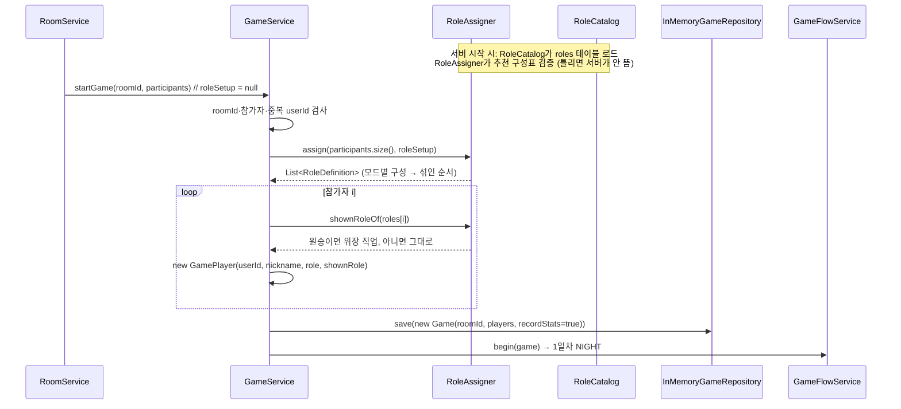

# 2. 플레이어 역할 배정

> 10/6 갱신 (`c10b44e`): **직업 배정 방식(추천·커스텀·랜덤)**이 추가됐습니다 [팀원 추가 · StopDragon `3705f56`]. 내가 만든 "인원수별 구성표 + 섞어서 배정 + 원숭이 위장" 구조는 그대로이고, 그 표가 "추천 구성(`RECOMMENDED`)"이 됐습니다.

## 한눈에 보기

- 게임을 만들 때(`GameService.start`) 한 번만 배정합니다.
- 직업 정의는 DB `roles` 테이블에서 서버 시작 시 읽어 `RoleCatalog`에 캐시합니다. 게임 중에는 DB를 다시 보지 않습니다.
- 배정 방식(`RoleSetupMode`) [팀원 추가]

| 모드 | 배정 방법 |
| --- | --- |
| `RECOMMENDED` (기본) | 서버의 인원수별 추천 구성표 `RoleAssigner.RECOMMENDED` 그대로 |
| `CUSTOM` | 방장이 편집한 인원수별 구성표. 편집하지 않은 인원수는 추천 구성 |
| `RANDOM` | 진영 수는 추천 구성과 같게, 각 진영 안의 특수 직업을 방장이 고른 후보 중 무작위로 |

- 어떤 모드든 마지막에 **섞어서(shuffle)** 참가자 순서대로 나눠 줍니다.
- 원숭이는 배정할 때 **위장 직업(`shownRole`)**이 한 번 정해지고 게임 끝까지 유지됩니다.
- 클라이언트는 `GET /api/v1/games/{gameId}/me`로 자기 직업을 조회합니다.

> 현재 dev에서 **방에서 시작하는 실제 게임은 항상 `RECOMMENDED`**입니다. `RoomService.startGame`이 설정 없이 `gameService.startGame(roomId, participants)`를 부르고, 방에 설정을 저장하는 `PUT /api/v1/rooms/{roomId}/role-setup`은 주석에만 있고 아직 없습니다. 커스텀·랜덤은 local 테스트 API(`POST /api/v1/games`의 `roleSetup`)로만 쓸 수 있습니다.

## 호출 흐름



## 핵심 코드

### `GameService.start`

```java
// 방에서 시작 (설정 없음 → 추천 구성)
public StartGameResponse startGame(String roomId, List<GameParticipant> participants) {
    return startGame(roomId, participants, null);
}
// 설정을 받는 버전 [팀원 추가] — 로비가 방에 설정을 저장하게 되면 이걸 호출
public StartGameResponse startGame(String roomId, List<GameParticipant> participants, RoleSetup roleSetup) {
    return start(roomId, participants, roleSetup, true);
}

private StartGameResponse start(String roomId, List<GameParticipant> participants, RoleSetup roleSetup, boolean recordStats) {
    // roomId 필수, 참가자 1명 이상, userId null·중복 금지 → 위반 시 GameRuleException(409)
    List<RoleDefinition> roles = roleAssigner.assign(participants.size(), roleSetup);
    List<GamePlayer> players = new ArrayList<>();
    for (int i = 0; i < participants.size(); i++) {
        GameParticipant p = participants.get(i);
        RoleDefinition role = roles.get(i);
        players.add(new GamePlayer(p.userId(), p.nickname(), role, roleAssigner.shownRoleOf(role)));
    }
    Game game = gameRepository.save(new Game(roomId, players, recordStats));
    gameFlowService.begin(game);
    ...
}
```

- `recordStats`: 방에서 시작한 게임은 `true`(전적 반영), local 테스트 API(`POST /api/v1/games`)로 만든 게임은 `false`.
- `gameId`는 `UUID.randomUUID()`입니다.

### `RoleAssigner.assign`

```java
public List<RoleDefinition> assign(int playerCount, RoleSetup setup) {
    if (playerCount < MIN_PLAYERS || playerCount > MAX_PLAYERS) throw new GameRuleException("플레이어 수는 4~12명...");
    RoleSetupMode mode = setup == null || setup.mode() == null ? RoleSetupMode.RECOMMENDED : setup.mode();
    List<RoleDefinition> assigned = switch (mode) {
        case RECOMMENDED -> new ArrayList<>(recommended.get(playerCount));
        case CUSTOM      -> customComposition(playerCount, setup);              // [팀원 추가]
        case RANDOM      -> randomComposition(playerCount, setup.randomCandidates()); // [팀원 추가]
    };
    Collections.shuffle(assigned, random);   // random = SecureRandom (테스트에서는 시드 고정 가능)
    return assigned;
}
```

### 추천 구성표 (`RoleAssigner.RECOMMENDED`, 이전 이름 `COMPOSITIONS`)

| 인원 | 해적 | 앵무새 | 선장 | 선의 | 망루지기 | 갑판장 | 원숭이 | 주정뱅이 | 선원 |
| --- | --- | --- | --- | --- | --- | --- | --- | --- | --- |
| 4 | 1 |  | 1 | 1 |  |  |  |  | 1 |
| 5 | 1 |  | 1 | 1 |  |  |  |  | 2 |
| 6 | 2 |  | 1 | 1 |  |  |  |  | 2 |
| 7 | 2 |  | 1 | 1 | 1 |  | 1 |  | 1 |
| 8 | 2 |  | 1 | 1 | 1 | 1 | 1 |  | 1 |
| 9 | 2 | 1 | 1 | 1 | 1 | 1 | 1 | 1 |  |
| 10 | 2 | 1 | 1 | 1 | 1 | 1 | 1 | 1 | 1 |
| 11 | 2 | 1 | 1 | 1 | 1 | 1 | 1 | 1 | 2 |
| 12 | 3 | 1 | 1 | 1 | 1 | 1 | 1 | 1 | 2 |

### 구성 규칙 검증 (`problemOf`) — 서버 시작 시 + 커스텀 저장·시작 시

```java
if (roles.size() != playerCount) return "직업 수가 인원수와 다릅니다.";
if (roles.stream().noneMatch(RoleDefinition::isRaider)) return "공격할 수 있는 해적이 1명 이상 있어야 합니다.";
long pirates = roles.stream().filter(RoleDefinition::isPirate).count();
if (pirates * 2 >= playerCount) return "해적 진영은 선원 진영보다 적어야 합니다.";   // [팀원 추가]
```

- 추천 구성표가 틀리면 **서버 시작 시점에** `IllegalStateException`으로 실패합니다. 밸런스를 바꿀 때 이 표만 고치면 됩니다.
- 커스텀 구성은 방장이 저장할 때 `normalize()`가 같은 규칙으로 검사(400)하고, 게임 시작 때 다시 확인(409)합니다. 서버 재시작 후 직업이 빠진 경우 등을 대비한 것입니다.

### 랜덤 구성 (`randomComposition`) [팀원 추가]

1. 해적 진영 자리 수 = 추천 구성의 해적 진영 수.
2. 해적 1명은 항상 넣습니다(공격할 해적 보장). 남은 해적 진영 자리는 해적(중복 가능)과 아직 안 뽑힌 해적 진영 후보(앵무새) 중 같은 확률로.
3. 선원 진영 자리는 후보를 섞어 앞에서부터 채우고, 모자라면 선원.
4. 특수 직업은 한 게임에 한 명씩만.

### 설정 화면용 API (`GET /api/v1/role-setup/options`) [팀원 추가]

```json
{ "minPlayers": 4, "maxPlayers": 12,
  "roles": [ { "code": "PIRATE_RAIDER", ... }, ... ],        // 해적 진영 → 선원 진영, 선원은 맨 뒤
  "randomCandidates": ["PIRATE_PARROT", "CREW_CAPTAIN", ...], // 해적·선원은 항상 후보라 빠짐
  "recommended": [ { "playerCount": 4, "roles": [...] }, ... ] }
```

- Unity `JsonUtility`가 Map을 못 읽어서 인원수별 표를 `RoleComposition(playerCount, roles)` 배열로 줍니다.

### 원숭이 위장 (`shownRoleOf`)

```java
public RoleDefinition shownRoleOf(RoleDefinition role) {
    if (!role.isMonkey()) return role;
    return monkeyDisguises.get(random.nextInt(monkeyDisguises.size())); // 선장·선의·망루지기·갑판장·주정뱅이 중 하나
}
```

### `GamePlayer`: 실제 직업과 보이는 직업

| 필드 | 쓰는 곳 |
| --- | --- |
| `role` (실제 직업) | 승리 판정, 게임 결과 공개, 선장 조사·주정뱅이 결과(남이 나를 볼 때) |
| `shownRole` (보이는 직업) | `/me` 응답, 밤에 쓸 수 있는 능력 결정. 원숭이만 `role`과 다름 |

### 내 역할 조회 (`GET /games/{gameId}/me`)

```java
public MyRoleResponse getMyRole(String gameId, Long playerId) {
    Game game = findGame(gameId);
    game.touch(playerId, clock.instant());                     // 접속 기록 [팀원 추가]
    synchronized (game) {
        GamePlayer me = game.getPlayer(playerId);                 // 이 게임 참가자가 아니면 409
        List<Long> teammates = game.knownPirateAllies(me).stream() // isPirate()가 아니라 접선 규칙 반영
                .map(GamePlayer::getPlayerId).toList();
        return MyRoleResponse.of(me, teammates);                    // shownRole 기준
    }
}
```

응답 필드: `playerId, role, roleName, faction, actionCode, remainingUses(-1=무제한/능력 없음), alive, mafiaTeammateIds, contacted`

**해적 동료 공개 규칙** (`Game.knownPirateAllies`)

- 해적끼리는 처음부터 서로 압니다.
- 앵무새는 해적 진영이지만, **접선한 뒤에만** 해적과 서로 보입니다.
- 그래서 동료 목록·해적 채팅 같은 권한은 `isPirate()`가 아니라 이 메서드로 판단해야 합니다. 채팅 담당도 밤 채팅 권한을 이 규칙으로 맞췄습니다.

## 리뷰 포인트

1. **4~6인 추천 구성은 신규 직업 추가 전과 같습니다.** 기존 Postman 시나리오 A·B·C가 그대로 돌아갑니다.
2. **방 ↔ 배정 설정 연결이 남음**: `RoleSetup`을 방(Redis)에 저장하고 `startGame(roomId, participants, roleSetup)`을 호출하는 로비 쪽 작업이 필요합니다.
3. **동료 해적 공격 가능**: 해적이 다른 해적·앵무새를 지목하는 것을 막지 않습니다. 규칙 확정이 필요합니다.
4. **원숭이 위장이 실제 직업과 겹칠 수 있음**: 같은 직업이 둘로 보일 수 있습니다(의도된 동작).
5. **`/me`는 참가자 검증을 `getPlayer`로 합니다**: 참가자가 아니면 404가 아니라 409(`GAME_RULE_VIOLATION`)가 나옵니다.
6. 인원 검사가 두 번 있습니다(로비 `MIN_PLAYERS` 빠른 검사 + 게임 `assign` 최종 검사). 상수는 `RoleAssigner` 한 곳에서 가져옵니다.
