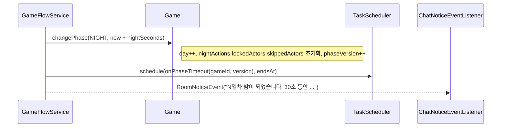
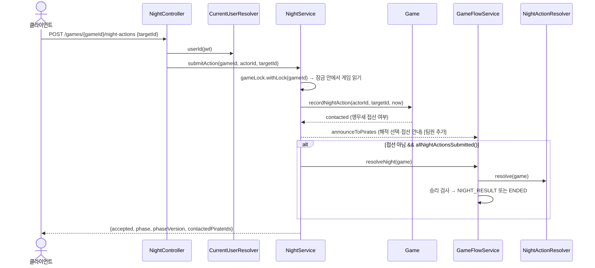

# 3. 밤 상태 · 능력 사용 (시민팀 / 마피아팀)

> 10/6 갱신 (`c10b44e`): 밤 판정 구조는 그대로입니다. 바뀐 점 [팀원 추가]
> - 해적의 공격 대상 선택·넘기기, 앵무새 접선을 **해적에게만 보이는 채팅 안내**로 알림 (kimdandy `348f4a6`)
> - 차단 결과 `BLOCK`(갑판장) / `BLOCKED`(차단당한 사람) 개인 결과 추가 (kimdandy `348f4a6`) → 04번 문서
> - 밤 도중 **연결이 끊긴 사람**은 사망 처리되고, 그 사람의 제출과 그 사람을 노린 제출이 지워짐 (StopDragon `50e9431`)
> - 판정 중 예외가 나면 게임 **취소** (StopDragon `50e9431`) → 07·08번 문서

## 한눈에 보기

- 게임 시작 직후와 처형 결과(EXECUTION)가 끝난 뒤 **NIGHT**에 들어갑니다. 들어갈 때 `day`가 1 오르고, 지난밤 제출 기록이 지워집니다.
- 능력 있는 생존자는 `POST /night-actions {targetId}`로 제출하거나 `POST /night-actions/skip`으로 넘깁니다.
- 제출은 **기록만** 합니다. 실제 효과(사망, 조사 결과 등)는 밤이 끝날 때 `NightActionResolver`가 **한 번에** 판정합니다. 그래서 제출 순서가 결과에 영향을 주지 않습니다.
- 밤이 끝나는 조건: **제한 시간 종료** 또는 **능력을 쓸 수 있는 생존자 전원이 제출/넘기기**.
- 능력 규칙은 직업 이름이 아니라 `ActionCode`로 판정합니다.

| 팀 | 직업 | ActionCode | 효과 |
| --- | --- | --- | --- |
| 마피아(PIRATE) | 해적 | `SELECT_ATTACK_TARGET` | 해적들의 최다 지목 1명 공격 |
| 마피아(PIRATE) | 앵무새 | `WATCH_ACTION` | 대상의 행동 관찰. 해적을 지목하면 즉시 접선 |
| 시민(CREW) | 선장 | `INVESTIGATE_FACTION` | 대상 진영 조사 |
| 시민(CREW) | 선의 | `PROTECT` | 공격 대상이면 살림. 자기 보호 가능(이틀 연속 불가) |
| 시민(CREW) | 망루지기 | `WATCH_VISITORS` | 대상을 방문한 사람 |
| 시민(CREW) | 갑판장 | `BLOCK` | 대상의 그날 밤 행동 무효 |
| 시민(CREW) | 주정뱅이 | `READ_CORPSE_ROLE` | 시체의 실제 직업 (사망자만, 게임당 2회) |
| 시민(CREW) | 원숭이 | 위장 직업의 코드 | 효과 없음, 가짜 결과 |
| 시민(CREW) | 선원 | 없음 | - |

`ActionCode` 정의 (사용 단계, 최대 횟수, 살아 있는 대상 필요, 자기 대상 허용):

```java
INVESTIGATE_FACTION(NIGHT, -1, true,  false),
PROTECT            (NIGHT, -1, true,  true ),
WATCH_VISITORS     (NIGHT, -1, true,  true ),
BLOCK              (NIGHT, -1, true,  false),
READ_CORPSE_ROLE   (NIGHT,  2, false, false),
SELECT_ATTACK_TARGET(NIGHT,-1, true,  false),
WATCH_ACTION       (NIGHT, -1, true,  false);
```

## 호출 흐름

### 밤 진입



### 능력 제출



- 응답의 `phase`가 이미 `NIGHT_RESULT`면 이 제출로 밤이 끝난 것입니다.
- 넘기기(`skipAction`)도 같은 흐름이고, 마지막 사람이 넘기면 바로 판정합니다.

## 핵심 코드

### 제출 검증 (`Game.recordNightAction`)

검증 순서대로 실패하면 `GameRuleException`(409)입니다.

```java
requirePhase(GamePhase.NIGHT);                                   // 1. NIGHT인지
GamePlayer actor = getAlivePlayer(actorId, "행동하는 플레이어");     // 2. 행동자가 참가자이고 살아 있는지
if (lockedActors.contains(actorId)) throw ...;                   // 3. 접선으로 행동이 고정됐는지
GamePlayer target = getPlayer(targetId);                         // 4. 대상이 참가자인지
if (!actor.getShownRole().hasNightAction()) throw ...;           // 5. 밤 능력이 있는지 (원숭이는 위장 직업 기준)
ActionCode code = actor.getShownRole().actionCode();
if (!actor.hasUsesLeft(code)) throw ...;                         // 6. 남은 횟수
if (code.requiresLivingTarget() && !target.isAlive()) throw ...; // 7. 대상 생존 조건
if (!code.requiresLivingTarget() && target.isAlive()) throw ...; //    (주정뱅이는 사망자만)
if (!code.allowsSelfTarget() && selfTarget) throw ...;           // 8. 자기 대상
if (code == PROTECT && selfTarget && actor.selfProtectedOn(day - 1)) throw ...; // 9. 이틀 연속 자기 보호

nightActions.put(actorId, new NightAction(actorId, code, targetId)); // 판정 전 재제출은 덮어쓰기
skippedActors.remove(actorId);                                       // 넘겼다가 제출하면 제출이 이김
return tryContact(actor, target, code, now);
```

- **횟수 차감과 자기 보호 기록은 제출 때가 아니라 판정 때** 합니다. 그래야 같은 밤에 여러 번 바꿔도 1회만 차감되고, 차단당한 행동은 차감되지 않습니다.
- `NightAction.code`는 제출 당시 능력입니다. 원숭이는 위장 직업의 코드로 제출됩니다.

### 넘기기 (`Game.skipNightAction`)

```java
requirePhase(NIGHT);
getAlivePlayer(actorId, ...);
if (lockedActors.contains(actorId)) throw ...;            // 접선한 앵무새는 못 넘김
if (!actor.getShownRole().hasNightAction()) throw ...;    // 능력 없는 직업은 원래 제출할 필요 없음
nightActions.remove(actorId);                              // 마지막 선택이 이김
skippedActors.add(actorId);
```

### 조기 판정 조건 (`Game.allNightActionsSubmitted`)

```java
return players.values().stream()
        .filter(this::canActTonight)
        .allMatch(p -> nightActions.containsKey(p.getPlayerId()) || skippedActors.contains(p.getPlayerId()));

private boolean canActTonight(GamePlayer p) {
    if (!p.isAlive() || !p.getShownRole().hasNightAction()) return false;  // 사망자, 능력 없는 직업 제외
    ActionCode code = p.getShownRole().actionCode();
    if (!p.hasUsesLeft(code)) return false;                                // 횟수 소진 제외
    return code.requiresLivingTarget() || players.values().stream().anyMatch(o -> !o.isAlive()); // 시체 없을 때 주정뱅이 제외
}
```

- "쓸 수 없는 사람"까지 세면 밤이 절대 일찍 끝나지 않아서 빼고 셉니다.

### 앵무새 접선 (`Game.tryContact`)

```java
if (code != WATCH_ACTION || !actor.isParrot() || actor.isContacted() || !target.isRaider()) return false;
actor.markContacted(now);           // 접선 시각 기록 (해적 채팅 공개 범위에 쓸 예정)
lockedActors.add(actor.getPlayerId()); // 이번 밤 행동 고정 → 재제출·넘기기 409
return true;
```

- 접선은 판정이 아니라 **제출 즉시** 일어나서 갑판장이 막을 수 없습니다.
- `NightService`는 접선 제출 직후에는 조기 판정을 하지 않습니다. 해적이 새로 알게 된 동료를 보고 표를 바꿀 시간을 주기 위해서입니다.
- 접선하면 응답 `contactedPirateIds`에 해적 id가 담깁니다.

### 해적 전용 안내 (`NightService.announceToPirates`) [팀원 추가]

```java
if (contacted) {
    gameFlowService.announceToPirates(game, "앵무새 " + actor.getNickname() + "님이 해적과 접선했습니다.");
} else if (actor.isRaider()) {
    gameFlowService.announceToPirates(game, actor.getNickname() + "님이 " + 대상 + "님을 공격 대상으로 골랐습니다.");
}
// skipAction: 해적이 넘기면 "OOO님이 이번 밤 공격 대상 선택을 넘겼습니다."
```

- `GameFlowService.announceToPirates`가 `PirateNoticeEvent(roomId, gameId, message)`를 발행하고, 채팅 모듈이 **해적(접선한 앵무새 포함)에게만 보이는** 시스템 메시지로 저장합니다.
- 해적이 여러 명일 때 서로 누구를 노리는지 알 수 있게 하려는 것입니다. 다른 직업의 능력 사용은 비밀이라 알리지 않습니다.

### 밤 도중 연결 끊김 (`Game.depart`) [팀원 추가]

연결 끊김 검사(08번 문서)가 밤에 누군가를 내보내면:

```java
player.markDeparted();
if (player.isAlive()) { player.kill(); recordDeath(); }    // 사망 처리
nightActions.remove(playerId); skippedActors.remove(playerId); lockedActors.remove(playerId);  // 그 사람의 제출 삭제
// 그 사람을 대상으로 한 "살아 있는 대상" 능력 제출도 삭제 → 대상을 잃은 사람은 다시 고를 수 있음(접선 고정도 풀림)
```

- 그 사람이 해적의 공격 대상이었으면 해적에게 "OOO님이 사라져 공격 대상을 다시 골라야 합니다."를 안내합니다.
- 지운 뒤 남은 사람이 모두 제출한 상태면 타이머를 기다리지 않고 바로 판정합니다.

### 밤 판정 (`NightActionResolver.resolve`)

제출 순서와 관계없이 아래 순서로 한 번에 처리합니다.

| 단계 | 하는 일 | 코드 |
| --- | --- | --- |
| 0 | 살아 있는 행동자의 제출만 사용 | `submitted` |
| 1 | 차단 대상 수집 (원숭이의 위장 차단 제외) | `targetsOf(withoutMonkeys(...), BLOCK)` |
| 2 | 차단당한 사람의 행동 제거 (차단 행동 자체는 남김) | `unblocked` |
| 3 | 방문 기록 (공격 선택은 제외, 6에서 실행자 1명 추가) | `visits` |
| 4 | 유효 행동 = 원숭이 행동 제외 (방문 흔적은 3에 남음) | `effective` |
| 5 | 보호 대상 수집 | `protectedIds` |
| 6 | 공격: 해적 표 집계 → 최다(동률 무작위) → 보호 안 됐으면 `kill()` | `pickMostVoted`, `pickExecutor` |
| 7 | 개인 결과 생성 (행동한 본인에게만, 그 밤에 죽은 행동자도 받음). 갑판장은 `BLOCK` [팀원 추가] | `reportOf` |
| 7-1 | 차단당한 사람에게 `BLOCKED` 안내 (누가 막았는지는 비공개) [팀원 추가] | `PrivateReport.blocked()` |
| 8 | 원숭이 가짜 결과 (차단 안 된 원숭이만) | `fakeReportOf` |
| 9 | 사용 횟수 차감, 선의 자기 보호 날짜 기록 (`unblocked` 기준) | `recordUses` |

```java
Long attackTargetId = pickMostVoted(countVotes(effective));
if (attackTargetId != null) {
    visits.add(new NightAction(pickExecutor(effective, attackTargetId), SELECT_ATTACK_TARGET, attackTargetId));
    if (protectedIds.contains(attackTargetId)) saved = true;
    else { game.getPlayer(attackTargetId).kill(); killedId = attackTargetId; }
}
...
return new NightResult(game.getDay(), killedId, saved, freeze(reports));
```

- 해적이 여러 명이면 각자 지목하고 가장 많이 지목된 사람이 대상입니다. 그 사람에게 표를 준 해적 중 무작위 1명만 "방문자"로 기록됩니다(망루지기·앵무새에게 이 1명만 보임).
- 9단계에서 `effective`가 아니라 `unblocked`를 쓰는 이유: 원숭이도 위장 능력의 횟수가 똑같이 줄어야 들키지 않습니다.

## 규칙과 응답

| 상황 | 응답 |
| --- | --- |
| 성공 | 200 `{accepted:true, phase, phaseVersion, contactedPirateIds:[]}` |
| NIGHT가 아님, 사망자 행동, 능력 없음, 대상 조건 위반, 횟수 소진, 이틀 연속 자기 보호, 접선 후 변경 | 409 `GAME_RULE_VIOLATION` |
| `targetId` 없음 | 400 |
| 게임 없음 | 404 `GAME_NOT_FOUND` |

## 리뷰 포인트

1. **판정 시점 일괄 처리**: 제출 순서에 따른 차이가 없고, 재제출은 덮어쓰기라 클라이언트가 대상을 바꾸기 쉽습니다.
2. **모든 처리가 게임 잠금(`GameLock`) 안**: 같은 게임의 제출, 넘기기, 타이머 판정이 동시에 들어와도 한 번에 하나씩 처리됩니다(8번 문서).
3. **공격 표 0개면 사망자 없음**: 해적이 모두 넘기거나 모두 차단당하면 아무도 죽지 않습니다.
4. ~~아무도 행동하지 않으면 게임이 끝나지 않을 수 있음~~ → **해결 [팀원 추가]**: 10일 연속 사망자가 없으면 게임이 취소됩니다(06번 문서).
5. **해적 동료 공격 가능**: 규칙 확정이 필요합니다.
6. **해적 안내가 게임 잠금 안에서 동기 발행됨**: `announceToPirates`가 게임 잠금 안에서 채팅 저장(Redis)까지 실행합니다. 지금은 빠르지만 채팅 저장이 느려지면 밤 제출도 함께 느려집니다(08번 리뷰 포인트와 같은 문제).
7. 주석 처리된 이전 구현(`recordNightAction` 구버전, `Map<Long, Long> nightActions`)이 `Game`에 남아 있습니다. 정리 대상입니다.
