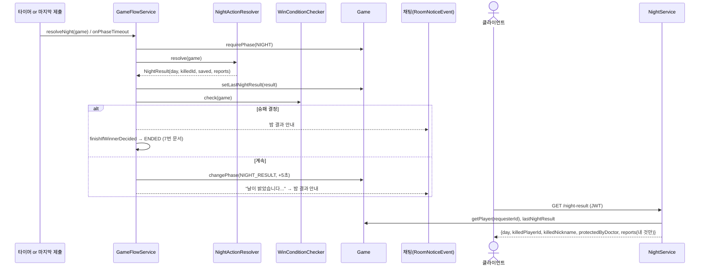

# 4. 밤 결과 공개

> 10/6 갱신 (`c10b44e`): 흐름은 그대로입니다. 바뀐 점 [팀원 추가]
> - 개인 결과 종류에 `BLOCK`(갑판장), `BLOCKED`(차단당한 사람) 추가 (kimdandy `348f4a6`)
> - 밤에 사망자가 나오면 `game.recordDeath()`로 "마지막 사망일"을 기록 → 10일 무사망 취소 판정에 사용 (StopDragon `50e9431`)
> - 판정 중 예외가 나면 그 페이즈에 멈추지 않고 게임을 **취소** (StopDragon `50e9431`)

## 한눈에 보기

- 밤 판정(`resolveNight`)이 끝나면 결과를 `Game.lastNightResult`에 저장하고, **먼저 승리 조건을 검사**합니다.
  - 승패가 났으면 → 바로 게임 종료(ENDED). NIGHT_RESULT로 가지 않습니다.
  - 아니면 → **NIGHT_RESULT** 페이즈(기본 5초) → DAY.
- 결과는 두 종류입니다.

| 구분 | 내용 | 누가 보나 |
| --- | --- | --- |
| 공개 결과 | 사망자(`killedPlayerId`, `killedNickname`), 보호 성공(`protectedByDoctor`) | 전원 |
| 개인 결과 `reports` | 조사·감시·관찰·시체 확인 결과 | 행동한 본인만 |

- 클라이언트는 `GET /api/v1/games/{gameId}/night-result`로 가져옵니다. 채팅에도 사망 안내가 시스템 메시지로 남습니다.

## 호출 흐름



## 핵심 코드

### `GameFlowService.doResolveNight`

```java
// resolveNight: gameLock.runWithLock(gameId, () -> { try { doResolveNight(game); } catch (RuntimeException e) { cancelAfterError(game, e); } }  [팀원 추가]

game.requirePhase(GamePhase.NIGHT);
NightResult result = nightActionResolver.resolve(game);
game.setLastNightResult(result);
if (result.killedPlayerId() != null) game.recordDeath();   // [팀원 추가] 무사망 일수 계산용

String nightMessage = nightResultMessage(game, result);
if (winConditionChecker.check(game).isPresent()) {
    announce(game, nightMessage);            // 채팅 순서: 밤 결과 → 승리
    finishIfWinnerDecided(game);
} else {
    moveTo(game, GamePhase.NIGHT_RESULT, phaseProps.nightResultSeconds());
    announce(game, nightMessage);            // 채팅 순서: 날이 밝았습니다 → 밤 결과
}
```

- 해적의 공격으로 승패가 갈릴 수 있어서(해적 수 ≥ 나머지) 밤 직후에도 검사합니다.
- 채팅 안내 순서가 자연스럽도록 분기마다 `announce` 위치를 다르게 했습니다.

채팅 안내 문구 (`nightResultMessage`)

| 상황 | 문구 |
| --- | --- |
| 사망자 있음 | "지난밤 OOO님이 해적의 습격을 받아 사망했습니다." |
| 보호 성공 | "지난밤 해적의 습격이 있었지만, 선의의 보호로 아무도 죽지 않았습니다." |
| 아무 일 없음 | "지난밤은 아무 일도 일어나지 않았습니다." |

### `NightService.getNightResult`

```java
GamePlayer requester = game.getPlayer(requesterId);       // 참가자가 아니면 409
NightResult nightResult = game.getLastNightResult();
if (nightResult == null) throw new GameRuleException("아직 공개된 밤 결과가 없습니다.");
List<ReportView> myReports = nightResult.reportsFor(requester.getPlayerId()).stream()
        .map(r -> toView(game, r)).toList();               // 내 결과만, id에 닉네임 붙여서
return new NightResultResponse(nightResult.day(), nightResult.killedPlayerId(),
        nicknameOf(game, nightResult.killedPlayerId()), nightResult.protectedByDoctor(), myReports);
```

- `lastNightResult`는 다음 밤 판정 때까지 유지돼서, DAY·VOTE 중에 다시 조회해도 같은 결과가 나옵니다.
- 페이즈를 검사하지 않으므로 NIGHT_RESULT가 지나도 조회할 수 있습니다.

### 개인 결과 형식 (`PrivateReport` → `ReportView`)

Unity `JsonUtility`가 다형성을 지원하지 않아서, 하위 타입 대신 한 객체에 nullable 필드를 둡니다. 목록 필드는 null 대신 빈 목록입니다.

| type | 직업 | 채워지는 필드 |
| --- | --- | --- |
| `FACTION` | 선장 | `targetId`, `targetNickname`, `faction` |
| `CORPSE_ROLE` | 주정뱅이 | `targetId`, `targetNickname`, `roleCode`, `roleName` |
| `VISITORS` | 망루지기 | `targetId`, `targetNickname`, `players[{playerId, nickname}]` |
| `ACTIONS` | 앵무새 | `targetId`, `targetNickname`, `actions[{actionCode, targetId, targetNickname}]` |
| `BLOCK` [팀원 추가] | 갑판장 (원숭이 갑판장도 똑같이 받음) | `targetId`, `targetNickname` |
| `BLOCKED` [팀원 추가] | 차단당해 능력이 무효가 된 사람 (원숭이 포함, 갑판장 제외) | 없음 (`targetId`도 null, 누가 막았는지 비공개) |

결과가 없는 능력: 공격, 보호(전체 공개 결과 `killed`/`protectedByDoctor`로 알림), 해적을 지목한 앵무새(접선으로 대신함).

응답 예시 (선장)

```json
{
  "day": 1,
  "killedPlayerId": 3,
  "killedNickname": "철수",
  "protectedByDoctor": false,
  "reports": [
    { "type": "FACTION", "targetId": 5, "targetNickname": "영희", "faction": "PIRATE",
      "roleCode": null, "roleName": null, "players": [], "actions": [] }
  ]
}
```

## 규칙과 응답

| 상황 | 응답 |
| --- | --- |
| 성공 | 200 위 형식 |
| 아직 밤 판정 전(1일차 NIGHT 중) | 409 "아직 공개된 밤 결과가 없습니다." |
| 이 게임 참가자가 아님 | 409 |
| 게임 없음 | 404 |

## 리뷰 포인트

1. **승리 시 NIGHT_RESULT를 건너뜀**: 클라이언트는 NIGHT에서 바로 ENDED로 바뀌는 경우를 처리해야 합니다. 이때도 `night-result`는 조회할 수 있어서 "누가 죽어서 끝났는지" 보여줄 수 있습니다(종료 후 60초 안).
2. **죽은 행동자도 개인 결과를 받음**: 그 밤에 죽은 선장도 조사 결과를 받습니다. 죽은 자 채팅 등에 쓰려는 의도입니다.
3. **원숭이 가짜 결과는 진짜와 형식이 같음**: 클라이언트는 구분할 수 없고, 구분하면 안 됩니다.
4. 공개 정보(사망자)는 채팅 시스템 메시지로도 나가므로, 클라이언트는 둘 중 하나만 써도 됩니다.
5. **클라이언트 반영 필요 [팀원 추가]**: `reports[].type`에 `BLOCK`, `BLOCKED`가 새로 올 수 있습니다. Unity 쪽에서 type별로 결과를 표시하는 코드에 이 두 값을 추가해야 합니다.
6. **연결 끊김 사망은 밤 결과에 안 나옴**: 연결이 끊겨 죽은 사람은 `killedPlayerId`가 아니라 채팅 안내("OOO님의 연결이 끊겨 사망 처리되었습니다.")와 상태 조회의 `alive=false`로만 알 수 있습니다.
