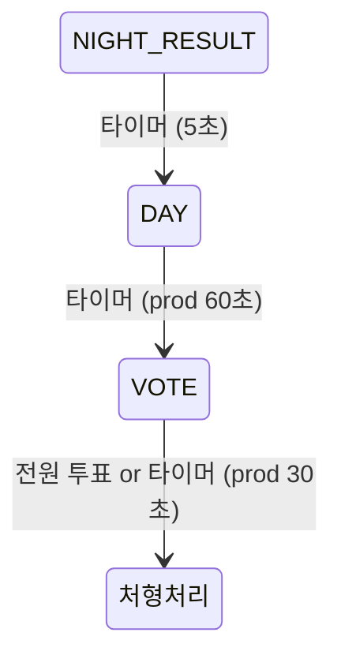
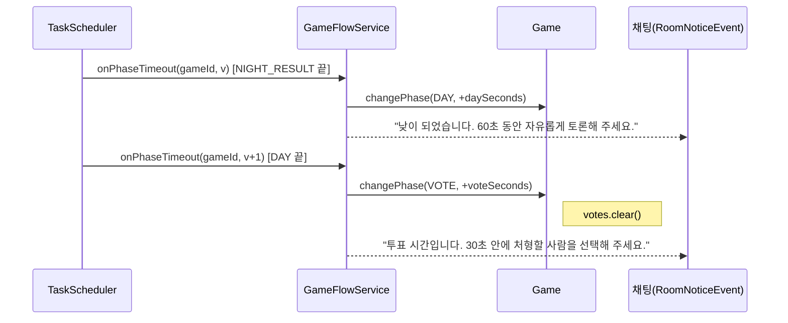
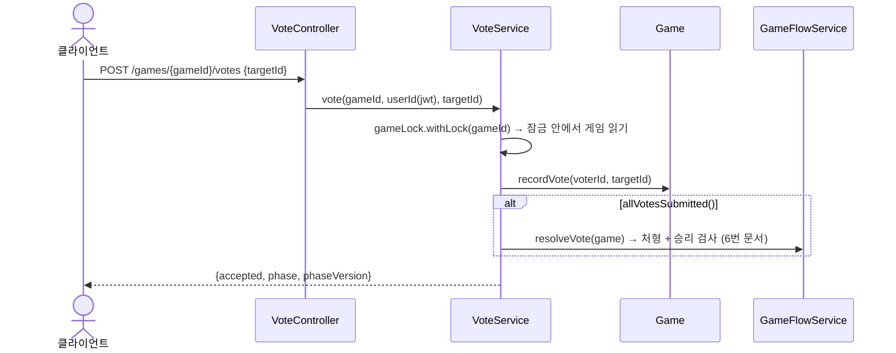

# 5. 낮 상태 · 투표 상태

> 10/6 갱신 (`c10b44e`): 투표 로직은 그대로입니다. 바뀐 점 [팀원 추가]
> - 투표 중 **연결이 끊긴 사람**은 사망 처리되고, 그 사람이 낸 표와 그 사람에게 간 표가 지워짐. 남은 생존자가 모두 냈으면 바로 처형 처리 (StopDragon `50e9431`)
> - 채팅 규칙: 사망자는 사망자끼리만 채팅, 밤에는 살아 있는 해적만 채팅 (kimdandy `1a7da64`·`bbf5d23`·`1454385`)

## 한눈에 보기

- **DAY**: NIGHT_RESULT 시간이 끝나면 타이머가 DAY로 넘깁니다. 서버가 하는 일은 시간 관리뿐이고, 토론은 채팅(팀원 담당)으로 합니다. DAY에서만 호출하는 게임 API는 없습니다.
- **VOTE**: DAY 시간이 끝나면 VOTE로 넘어가고, 생존자는 `POST /votes {targetId}`로 투표합니다.
  - 재투표는 덮어씁니다.
  - 생존자 전원이 투표하면 타이머를 기다리지 않고 바로 처형 처리합니다.
  - 시간이 끝나면 투표한 사람 기준으로 처형 처리합니다.



## 호출 흐름

### 페이즈 전환 (타이머)



### 투표



## 핵심 코드

### `Game.recordVote`

```java
public void recordVote(Long voterId, Long targetId) {
    requirePhase(GamePhase.VOTE);
    getAlivePlayer(voterId, "투표하는 플레이어");   // 사망자는 투표 불가
    getAlivePlayer(targetId, "투표 대상");          // 사망자는 투표 대상 불가
    votes.put(voterId, targetId);                    // 재투표 시 덮어쓰기
}

public boolean allVotesSubmitted() {
    return votes.size() >= aliveCount();
}
```

- `votes`는 VOTE에 들어갈 때(`changePhase`) 비웁니다.
- 자기 자신에게 투표하는 것은 막지 않습니다(규칙 확정 필요).
- 투표 취소(기권) API는 없습니다. 기권하려면 투표하지 않고 시간이 끝나길 기다립니다.

### `VoteService.vote`

```java
return gameLock.withLock(gameId, () -> {
    Game game = findGame(gameId);                       // 잠금 안에서 읽기
    game.recordVote(voterId, targetId, confirm);        // [팀원 추가] targetId 없음(0) = 기권, confirm = "투표 완료"
    gameRepository.save(game);
    if (game.allVotesSubmitted()) {                     // [팀원 추가] 투표할 수 있는 생존자가 모두 "완료"했는지
        gameFlowService.resolveVote(game);
    }
    return new VoteResponse(true, game.getPhase(), game.getPhaseVersion());
});
```

- 응답의 `phase`가 `EXECUTION` 또는 `ENDED`면 이 투표로 투표가 끝난 것입니다.

### 투표 중 연결 끊김 (`Game.depart`) [팀원 추가]

```java
votes.remove(playerId);                    // 끊긴 사람이 낸 표 삭제
votes.values().removeIf(playerId::equals); // 끊긴 사람에게 간 표 삭제
```

- 지우지 않으면 ① 끊긴 사람 표 때문에 남은 사람이 다 내기 전에 `allVotesSubmitted()`가 참이 되거나, ② 이미 죽은 사람이 처형 대상으로 다시 발표될 수 있습니다.
- 끊긴 사람에게 투표했던 사람은 다시 투표할 수 있습니다.

### 낮 채팅 규칙 (채팅 모듈) [팀원 추가]

| 누가 | 언제 | 보이는 대상 |
| --- | --- | --- |
| 생존자 | 낮·투표 등 밤이 아닐 때 | 전원 (`USER`) |
| 살아 있는 해적 (접선한 앵무새 포함) | 밤 | 해적만 (`pirateOnly`) |
| 그 밖의 생존자 | 밤 | 입력 불가 (403) |
| 사망자 | 언제든 | 같은 게임 사망자에게만, 자기가 죽은 뒤 대화만 (`DEAD`) |

- 해적 여부 판단은 게임의 `knownPirateAllies`와 같은 규칙입니다(02번 문서).

## 규칙과 응답

| 상황 | 응답 |
| --- | --- |
| 성공 | 200 `{accepted:true, phase, phaseVersion}` |
| VOTE가 아님, 사망자 투표, 사망자 지목, 참가자 아님 | 409 `GAME_RULE_VIOLATION` |
| `targetId` 없음 | 400 |
| 게임 없음 | 404 |

## 리뷰 포인트

1. **진행 중 득표 현황 API 없음**: 투표 중에는 누가 몇 표인지 볼 수 없고, 처형 결과(`execution-result`)에서만 공개됩니다. 실시간 득표 표시가 필요하면 API 추가가 필요합니다.
2. **DAY에는 서버 로직이 없음**: 낮 시간을 늘리거나 줄이는 기능(예: 시간 연장 투표)은 없습니다.
3. ~~채팅 권한: 사망자도 일반 채팅 가능~~ → **해결 [팀원 추가]**: 사망자는 사망자 채팅(`DEAD`)으로 분리되고, 밤에는 해적만 채팅합니다.
4. **자기 투표 허용**: 규칙 확정 필요.
