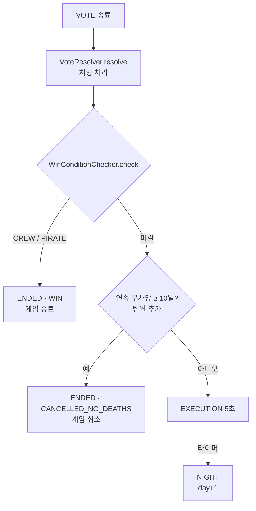
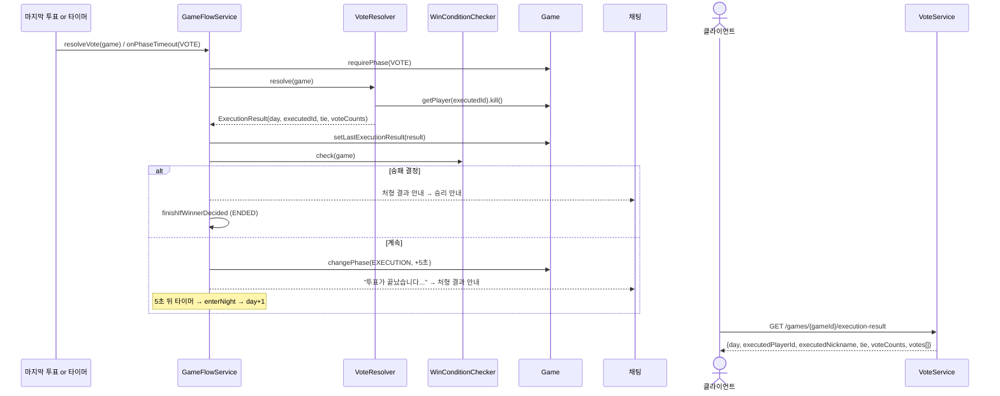

# 6. 처형 처리 · 승리 조건 검사 · 밤 반복

> 10/6 갱신 (`c10b44e`): 바뀐 점 [팀원 추가 · StopDragon `50e9431`]
> - **승리 조건 변경**: 접선하지 못한 앵무새만 남으면 선원팀 승리
> - **10일 연속 사망자가 없으면** 그날 처형 결과 직후 게임 **취소** (끝나지 않는 게임 방지)
> - 처형·밤 사망·연결 끊김 사망 때마다 `recordDeath()`로 마지막 사망일 기록
> - 처리 중 예외가 나면 게임 취소

## 한눈에 보기

- 투표가 끝나면(전원 투표 또는 시간 종료) `GameFlowService.doResolveVote`가 아래를 **한 번에** 처리합니다.
  1. **처형**: 최다 득표자 1명 사망. 동률이거나 아무도 투표하지 않으면 처형 없음.
  2. **승리 조건 검사**
  3. 승패가 났으면 → **ENDED(WIN)** (7번 문서).
  4. [팀원 추가] 아니고, 연속 무사망 일수가 `max-days-without-death`(10) 이상이면 → **ENDED(CANCELLED_NO_DEATHS)**.
  5. 아니면 → **EXECUTION**(기본 5초)로 결과를 보여 준 뒤 → 다음 날 **NIGHT** (반복).
- 승리 조건은 **밤 판정 직후**와 **연결 끊김으로 사망자가 생겼을 때**에도 같은 방식으로 검사합니다.



## 호출 흐름



## 핵심 코드

### 처형 (`VoteResolver.resolve`)

```java
Map<Long, Integer> counts = new LinkedHashMap<>();
game.getVotes().forEach((voterId, targetId) -> {
    if (game.getPlayer(voterId).isAlive()) counts.merge(targetId, 1, Integer::sum);
});
if (counts.isEmpty()) return new ExecutionResult(game.getDay(), null, false, Map.of());   // 무투표

int max = counts.values().stream().max(Integer::compare).orElse(0);
var top = counts.entrySet().stream().filter(e -> e.getValue() == max).toList();
if (top.size() > 1) return new ExecutionResult(game.getDay(), null, true, Map.copyOf(counts)); // 동률

Long executedId = top.get(0).getKey();
game.getPlayer(executedId).kill();
return new ExecutionResult(game.getDay(), executedId, false, Map.copyOf(counts));
```

| 결과 | `executedPlayerId` | `tie` |
| --- | --- | --- |
| 처형 | 처형된 id | false |
| 동률 | null | true |
| 무투표 | null | false |

- 밤 공격은 동률이면 무작위지만, **투표는 동률이면 처형하지 않습니다.**

### 승리 조건 (`WinConditionChecker.check`)

```java
// [팀원 추가] 해적 편으로 "활동하는" 생존자: 해적 + 접선한 앵무새
long activePirates = game.getPlayers().stream()
        .filter(p -> p.isAlive() && (p.isRaider() || (p.isParrot() && p.isContacted())))
        .count();
long aliveMafia   = game.getPlayers().stream().filter(p -> p.isAlive() && p.isPirate()).count(); // 앵무새 포함
long aliveCitizen = game.getPlayers().stream().filter(GamePlayer::isAlive).count() - aliveMafia;

if (activePirates == 0)         return Optional.of(Faction.CREW);    // 선원팀 (이전: aliveMafia == 0)
if (aliveMafia >= aliveCitizen) return Optional.of(Faction.PIRATE);  // 해적팀: 해적 진영 수 ≥ 나머지
return Optional.empty();
```

| 생존 상황 | 이전 (내 구현) | 지금 |
| --- | --- | --- |
| 해적 0, 접선 안 한 앵무새 1 | 계속 진행 | **CREW 승리** (앵무새 혼자서는 해적 편에 합류 불가) |
| 해적 0, 접선한 앵무새 1 | 계속 진행 | 계속 진행 |
| 해적 진영 수 ≥ 나머지 | PIRATE 승리 | PIRATE 승리 (앵무새는 접선 여부와 관계없이 셈) |

- `isPirate()`는 **실제 직업의 진영** 기준입니다. 해적과 앵무새가 해적 진영, 원숭이는 CREW입니다.
- 서버만 판정하고 클라이언트는 `phase=ENDED`, `winner`, `endReason`을 받아 보여 주기만 합니다.

### 무사망 일수 (`Game.recordDeath` / `daysWithoutDeath`) [팀원 추가]

```java
public void recordDeath()      { this.lastDeathDay = day; }        // 밤 사망, 처형, 연결 끊김 사망 때 호출
public int daysWithoutDeath()  { return day - lastDeathDay; }       // 1일차부터 아무도 안 죽었으면 day와 같음

private boolean tooLongWithoutDeath(Game game) {
    int maxDays = phaseProps.maxDaysWithoutDeath();                  // 기본 10, 0 이하면 검사 안 함
    return maxDays > 0 && game.daysWithoutDeath() >= maxDays;
}
```

### 분기 (`GameFlowService.doResolveVote`)

```java
// resolveVote: gameLock.runWithLock(gameId, () -> { try { doResolveVote(game); } catch (RuntimeException e) { cancelAfterError(game, e); } }  [팀원 추가]

game.requirePhase(GamePhase.VOTE);
ExecutionResult result = voteResolver.resolve(game);   // 7. 처형
game.setLastExecutionResult(result);
if (result.executedPlayerId() != null) game.recordDeath();   // [팀원 추가]

String executionMessage = executionResultMessage(game, result);
if (winConditionChecker.check(game).isPresent()) {     // 8. 승리 조건 검사
    announce(game, executionMessage);
    finishIfWinnerDecided(game);                       // 9. 종료
} else if (tooLongWithoutDeath(game)) {                // [팀원 추가] 끝나지 않는 게임 방지
    announce(game, executionMessage);
    cancel(game, GameEndReason.CANCELLED_NO_DEATHS);   // 7번 문서
} else {
    moveTo(game, GamePhase.EXECUTION, phaseProps.executionSeconds());
    announce(game, executionMessage);                  // 9. 반복: EXECUTION 타이머 → enterNight
}
```

### 반복 (EXECUTION → NIGHT)

```java
// onPhaseTimeout
case EXECUTION -> enterNight(game);   // changePhase(NIGHT): day++, 밤 기록 초기화
```

### 처형 결과 조회 (`VoteService.getExecutionResult`)

- `votes`: 득표 많은 순, 같으면 playerId 순 목록. Unity `JsonUtility`가 Map을 못 읽어서 추가했습니다.
- `voteCounts`(Map)는 기존 클라이언트·Postman 호환용으로 남겨 두었습니다.

```json
{
  "day": 1, "executedPlayerId": 5, "executedNickname": "영희", "tie": false,
  "voteCounts": { "5": 3, "2": 1 },
  "votes": [ { "playerId": 5, "nickname": "영희", "count": 3 },
             { "playerId": 2, "nickname": "민수", "count": 1 } ]
}
```

채팅 안내 문구

| 상황 | 문구 |
| --- | --- |
| 처형 | "투표 결과 OOO님이 처형되었습니다." |
| 동률 | "투표가 동률로 끝나 아무도 처형되지 않았습니다." |
| 무투표 | "아무도 투표하지 않아 처형이 진행되지 않았습니다." |
| CREW 승리 | "모든 해적이 사라졌습니다. 선원 팀이 승리했습니다!" |
| PIRATE 승리 | "해적이 배를 장악했습니다. 해적 팀이 승리했습니다!" |
| 10일 무사망 취소 [팀원 추가] | "10일 동안 아무도 죽지 않아 게임이 취소되었습니다. 이번 게임은 전적에 반영되지 않으며, 잠시 후 방이 사라집니다." |

## 리뷰 포인트

1. **처형 후 승리 시 EXECUTION을 건너뜀**: VOTE에서 바로 ENDED가 됩니다. 클라이언트는 이때도 `execution-result`로 누가 처형됐는지 보여 줄 수 있습니다(종료 후 60초 안).
2. ~~무한 진행 가능~~ → **해결 [팀원 추가]**: 10일 연속 무사망이면 취소됩니다. 검사는 투표 결과 직후에만 하므로, 10일째 밤이 아니라 10일째 처형 결과 뒤에 취소됩니다.
3. ~~앵무새만 남은 경우 계속 진행~~ → **해결 [팀원 추가]**: 접선하지 못한 앵무새만 남으면 CREW 승리. 접선한 앵무새가 남으면 공격 수단이 없어도 계속 진행되며, 무사망 10일 규칙으로 결국 취소됩니다. 이 경우를 CREW 승리로 볼지는 규칙 확정이 필요합니다.
4. `finishIfWinnerDecided`가 `check`를 한 번 더 호출합니다(분기에서 이미 호출). 결과는 같아서 동작 문제는 없지만, 결과를 넘겨 받도록 정리할 수 있습니다.
