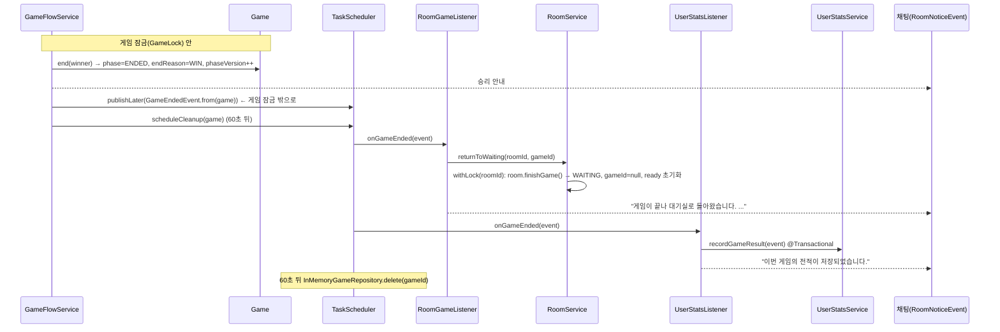
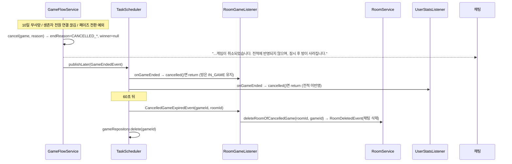

# 7. 게임 종료 · 기존 방으로 복귀

> 10/6 갱신 (`c10b44e`): 승리 종료 → 방 복귀 흐름은 그대로입니다. 바뀐 점
> - [팀원 추가 · StopDragon `50e9431`] 승패 없이 끝나는 **게임 취소**(`GameEndReason.CANCELLED_*`)가 생김. 취소된 게임은 방으로 돌아가지 않고 60초 뒤 **방이 삭제**되며 전적에 반영되지 않음
> - [팀원 추가] 종료 이벤트 발행 메서드가 `publishGameEnded` → 범용 `publishLater(event)`로 바뀜 (잠금 밖 발행 원칙은 그대로)
> - [팀원 추가 · DoroNyong `c10b44e`] `UserStatsListener`, `UserStatsService`가 `member` → `user` 패키지로 이동

## 한눈에 보기

게임이 끝나는 경우는 두 가지입니다.

| 종료 | `endReason` | `winner` | 방 | 전적 |
| --- | --- | --- | --- | --- |
| 승리 (내 구현) | `WIN` | `CREW` / `PIRATE` | **WAITING으로 복귀** → 같은 방에서 다시 시작 | 반영 |
| 취소 [팀원 추가] | `CANCELLED_ALL_DISCONNECTED` / `CANCELLED_NO_DEATHS` / `CANCELLED_ERROR` | `null` | 60초 동안 IN_GAME 유지 → **삭제** | 미반영 |

- 두 경우 모두 `GameEndedEvent`를 발행하고, **게임은 로비·회원 코드를 직접 부르지 않습니다.**

| 구독자 | 승리 | 취소 |
| --- | --- | --- |
| `RoomGameListener` (lobby) | 방을 WAITING으로 복귀 | 아무것도 안 함 (나중에 `CancelledGameExpiredEvent`로 삭제) |
| `UserStatsListener` (user) | `playCount + 1`, 이긴 진영이면 `winCount + 1` | 건너뜀 |

- 끝난 게임은 결과 조회를 위해 **60초** 메모리에 남겼다가 삭제합니다. 이후 조회는 404입니다.
- 클라이언트: `phase=ENDED` 확인 → `endReason` 확인 → `GET /games/{gameId}/result`로 결과 표시 → 승리면 같은 roomId 대기 화면, 취소면 로비로.

## 호출 흐름

### 승리 종료 → 방 복귀



### 취소 → 방 삭제 [팀원 추가]



## 핵심 코드

### 승리 종료 (`GameFlowService.finishIfWinnerDecided`)

```java
Optional<Faction> winner = winConditionChecker.check(game);
if (winner.isEmpty()) return false;
game.end(winner.get());                 // phase=ENDED, endReason=WIN, phaseEndsAt=null, phaseVersion++
gameRepository.save(game);
announce(game, winMessage(winner.get()));
publishLater(GameEndedEvent.from(game)); // 잠금 안에서 복사한 이벤트를 잠금 밖에서 처리
scheduleCleanup(game);                   // 60초 뒤 메모리에서 삭제
return true;
```

- `phaseVersion`이 오르므로, 이미 예약된 페이즈 타이머가 늦게 실행돼도 무시됩니다.

### 게임 취소 (`GameFlowService.cancel`) [팀원 추가]

```java
private void cancel(Game game, GameEndReason reason) {     // 게임 잠금(GameLock) 안에서 호출
    if (game.isEnded()) return;
    game.cancel(reason);                                    // winner=null, endReason=reason, phase=ENDED
    gameRepository.save(game);
    announce(game, cancelMessage(reason));
    publishLater(GameEndedEvent.from(game));
    scheduleCleanup(game);
}
```

| 취소 사유 | 언제 | 문서 |
| --- | --- | --- |
| `CANCELLED_NO_DEATHS` | 10일 연속 사망자 없음 (투표 결과 직후 검사) | 06 |
| `CANCELLED_ALL_DISCONNECTED` | 살아 있는 플레이어가 모두 연결 끊김 | 08 |
| `CANCELLED_ERROR` | 페이즈 전환·판정 중 예외 (`cancelAfterError`) | 08 |

### 종료 이벤트를 잠금 밖에서 발행하는 이유 (`publishLater`)

```java
private void publishLater(Object event) {               // 이전: publishGameEnded(Game)
    deferredEvents.publishAfterLock(event);             // 10/8: DeferredEventPublisher 인터페이스로 분리
}
// 지금 구현 SchedulerDeferredEventPublisher: 스케줄러 스레드에 "지금 시각"으로 예약해 발행, 리스너 예외는 로그만
scheduler.schedule(() -> { try { eventPublisher.publishEvent(event); } catch (RuntimeException e) { log.error(...); } },
                   clock.instant());
```

- 이 메서드는 게임 잠금(`GameLock`) 안에서 불립니다. 그대로 이벤트를 발행하면 리스너가 **게임 잠금을 쥔 채로 방 잠금**을 잡습니다.
- 반대로 게임 시작은 **방 잠금 → 게임 잠금** 순서입니다. 두 순서가 엇갈리면 교착 상태(deadlock)가 생길 수 있어서, 스케줄러 스레드로 넘겨 게임 잠금이 풀린 뒤 처리합니다.
- 팀원이 추가한 `PlayersDepartedEvent`도 같은 메서드로 발행해서 이 원칙이 유지됩니다.

### `GameEndedEvent`

```java
public record GameEndedEvent(String gameId, String roomId,
                             Faction winner,              // 취소면 null
                             GameEndReason endReason,     // [팀원 추가]
                             int lastDay, boolean recordStats, List<PlayerOutcome> outcomes) {
    public record PlayerOutcome(Long userId, String roleCode, Faction faction, boolean alive, boolean win) {}
    // win = 실제 직업의 진영 == winner (앵무새는 PIRATE 승리 때, 원숭이는 CREW 승리 때 승)
    public boolean cancelled() { return endReason != null && endReason.isCancelled(); }  // [팀원 추가]
}
```

### 방 복귀 (`RoomGameListener` → `RoomService.returnToWaiting`)

```java
@EventListener
public void onGameEnded(GameEndedEvent event) {
    try {
        Long roomId = parseRoomId(event.roomId());
        if (roomId == null) return;                         // local 테스트 게임(방 없음)
        if (event.cancelled()) return;                      // [팀원 추가] 취소된 게임은 나중에 방 삭제
        if (roomService.returnToWaiting(roomId, event.gameId())) {
            eventPublisher.publishEvent(RoomNoticeEvent.of(roomId, "게임이 끝나 대기실로 돌아왔습니다. ..."));
        }
    } catch (RuntimeException e) {
        log.error(...);                                     // 다른 리스너(전적 저장)는 계속 실행되도록
    }
}

public boolean returnToWaiting(Long roomId, String gameId) {
    return roomLockManager.withLock(roomId, () -> {
        Room room = roomRepository.findById(roomId);
        if (room == null) return false;                              // 방이 사라짐
        if (!room.isInGame()) return false;                          // 이미 복귀됨
        if (!Objects.equals(room.getGameId(), gameId)) return false; // 이전 게임의 늦은 이벤트
        room.finishGame();
        roomRepository.save(room);
        return true;
    });
}
```

- 세 가지 무시 조건 덕분에 이벤트가 중복·지연돼도 안전합니다(멱등).
- 이벤트 처리가 실패해도 다음 방 조회·입장·시작 때 `recoverIfOrphaned`가 복구합니다(01번 문서).
- `RoomGameListener`는 이제 이벤트 3개를 받습니다: `GameEndedEvent`(복귀), `PlayersDepartedEvent`(이탈자 제외) [팀원 추가], `CancelledGameExpiredEvent`(취소 방 삭제) [팀원 추가].

### 전적 저장 (`user.service.UserStatsListener` → `UserStatsService`)

```java
if (!event.recordStats()) return;            // local 테스트 게임은 제외
if (event.cancelled()) return;               // [팀원 추가] 취소된 게임은 제외
@Transactional
public int recordGameResult(GameEndedEvent event) {
    Map<Long, User> users = userRepository.findAllById(userIds)...;  // 한 번에 조회
    for (PlayerOutcome o : event.outcomes()) {
        User user = users.get(o.userId());
        if (user == null) continue;          // 탈퇴 등
        user.recordGame(o.win());            // dirty checking으로 UPDATE
    }
}
```

### 게임 결과 조회 (`GET /games/{gameId}/result`)

```java
if (!game.isEnded()) return new GameResultResponse(false, null, null, game.getDay(), List.of());  // 종료 전 역할 비공개
return new GameResultResponse(true, game.getWinner(), game.getEndReason(), game.getDay(),
        game.getPlayers().stream().map(PlayerResult::from).toList());   // 실제 직업(원숭이도 원숭이로)
```

응답: `{ended, winner, endReason, lastDay, players[{playerId, nickname, role, roleName, alive}]}`

### 메모리 정리 (`scheduleCleanup`)

```java
// 예약: gameTimer.scheduleCleanup(gameId, now + endedRetentionSeconds)   // 60초, 10/8 GameTimer로 분리
@Override public void onCleanup(String gameId) {                      // 시간이 되면 GameTimer가 호출
    CleanupTarget target = gameLock.withLock(gameId, () -> /* 잠금 안에서 roomId, 취소 여부만 읽기 */);
    if (target == null) return;
    if (target.cancelled()) publishNow(new CancelledGameExpiredEvent(gameId, target.roomId()));  // [팀원 추가] 방 삭제가 먼저 (게임 잠금 밖)
    gameRepository.delete(gameId);
    activityTracker.clear(gameId);                                     // 접속 기록도 정리
}
```

- 방 삭제를 게임 삭제보다 **먼저** 합니다. 게임이 먼저 사라지면 그사이 방 조회의 `recoverIfOrphaned`가 방을 WAITING으로 되돌려 삭제되지 않기 때문입니다.

## 클라이언트 처리 순서

1. `GET /games/{gameId}` polling 중 `phase == "ENDED"` 확인 (`winner`, `endReason` 포함).
2. **60초 안에** `GET /games/{gameId}/result`로 전원 직업 표시.
3. `endReason == "WIN"`이면 같은 roomId의 대기 화면으로 이동. 방은 이미 WAITING이라 방장이 바로 다시 시작할 수 있음.
4. `endReason`이 `CANCELLED_*`이면 취소 안내 후 **로비로** 이동. 방은 60초 뒤 삭제됨.

## 리뷰 포인트

1. **결과 조회 60초 제한**: 결과 화면을 오래 띄우거나 늦게 들어오면 404가 납니다. 클라이언트는 ENDED를 보자마자 결과를 받아 두는 게 안전합니다.
2. ~~방 복귀 시 유령 참가자~~ → **해결 [팀원 추가]**: 게임 중 연결이 끊긴 사람은 게임 중에 이미 방에서 빠집니다.
3. **클라이언트 반영 필요**: `winner == null`인 ENDED(취소)와 `endReason` 필드를 Unity에서 처리해야 합니다. 처리하지 않으면 취소된 게임에서 대기실로 돌아갔다가 방이 사라질 수 있습니다.
4. **전적 조회 API 없음**: 저장만 됩니다. 회원 담당과 프로필 응답에 추가 협의 필요.
5. **이벤트는 동기 리스너**: 스케줄러 스레드에서 리스너들이 순서대로 실행됩니다. 각 리스너가 자기 예외를 잡아서 서로 영향을 주지 않습니다.
