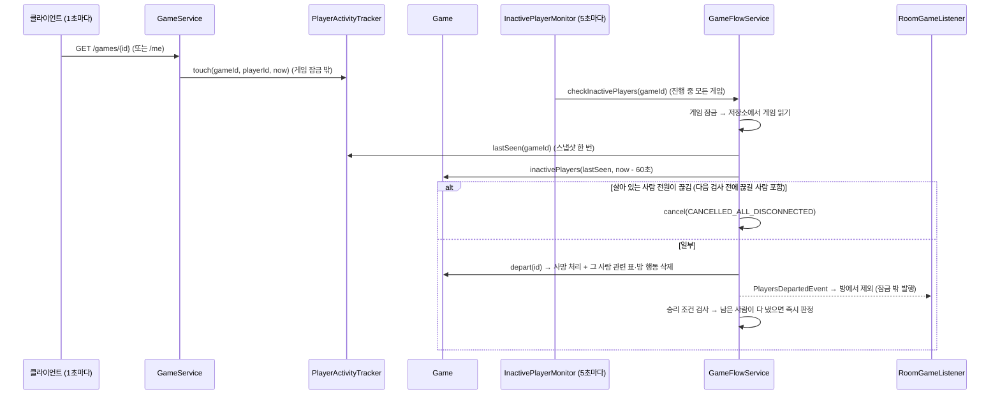
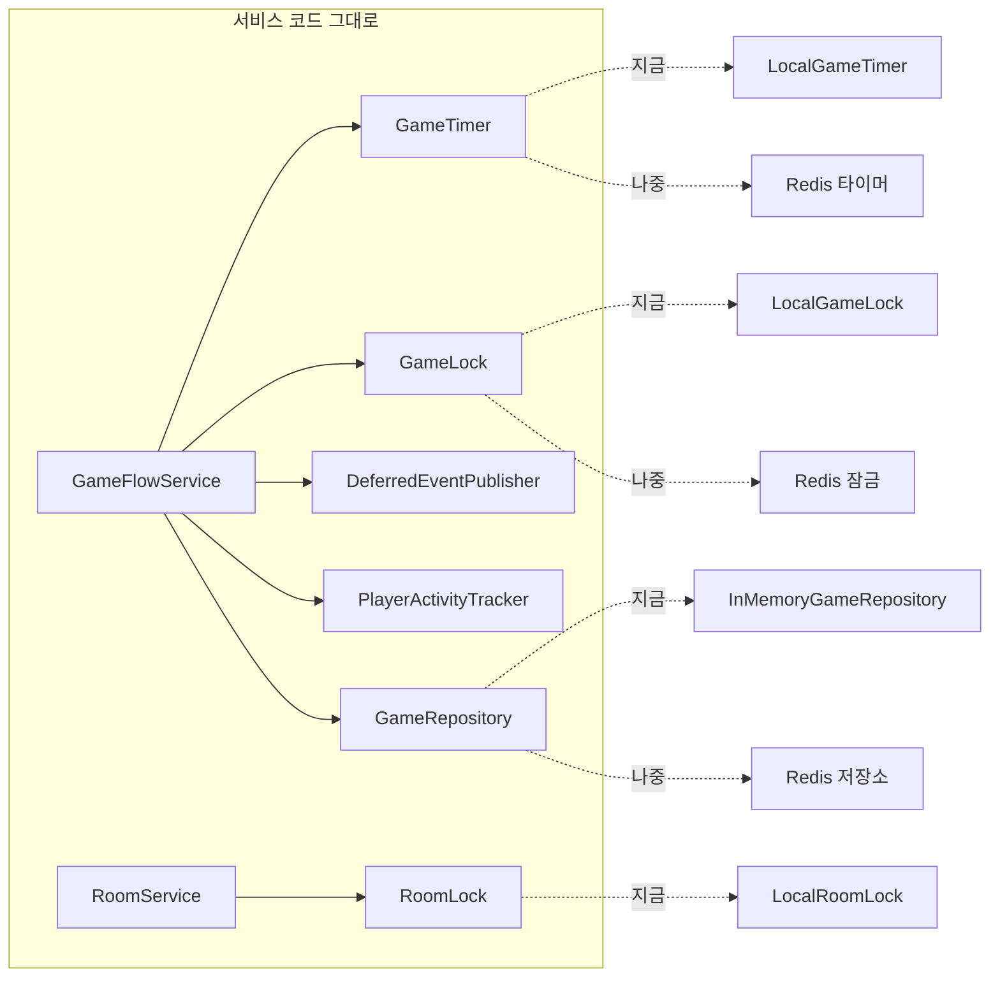

# 8. 공통: 페이즈 타이머 · 연결 끊김 검사 · 동시성 · 채팅 안내 · 예외

여러 흐름에서 함께 쓰는 구조입니다. 다른 문서를 읽기 전에 보면 이해가 쉽습니다.

> 10/8 갱신 (0단계: 멀티 서버 준비 — 인터페이스 분리) [내 작업]
> - 타이머·잠금·접속 기록·잠금 뒤 이벤트 발행을 **인터페이스로 분리** (`GameTimer`, `DeferredEventPublisher`, `GameLock`, `PlayerActivityTracker`, `RoomLock`). **동작 변화는 없습니다.** 자세한 내용은 아래 7) 절
> - `synchronized (game)` → `GameLock`, `RoomLockManager` → `RoomLock`, `Game.lastSeenAt` → `PlayerActivityTracker`
> - 스케줄러가 주입한 `Clock`을 사용 (`setClock`)
> - 저장 누락 점검 테스트 추가 (`CopyingGameRepository`, `GameSaveDisciplineTest`)
> - [팀원 추가] 동시 연결 끊김: 다음 검사 전에 끊길 생존자까지 세어서 전원 끊김이면 아무도 죽이지 않고 취소 (StopDragon `8de0f36`)
>
> 10/6 갱신 (`c10b44e`): 바뀐 점 [팀원 추가]
> - 페이즈 전환 중 예외 → 로그만 남기고 멈추던 것을 **게임 취소**로 처리 (StopDragon `50e9431`)
> - **연결 끊김 검사** `InactivePlayerMonitor` 추가. 상태 조회(`GET /games/{id}`)가 접속 기록을 겸함 (StopDragon `50e9431`)
> - 해적 전용 안내 `PirateNoticeEvent` 추가 (kimdandy `348f4a6`)
> - `CurrentUserResolver`가 `user.service` 패키지로 이동 (DoroNyong `c10b44e`)

## 1) 페이즈 타이머 (`GameFlowService`)

서버가 게임 루프를 주도합니다. 클라이언트가 페이즈를 넘기는 API는 없습니다.

```
start ─▶ NIGHT ─(시간 종료 or 전원 제출)─▶ NIGHT_RESULT ─▶ DAY ─▶ VOTE
           ▲                                  │(승리 시 ENDED)        │(전원 투표 or 시간 종료)
           │                                                          ▼
           └──────────── EXECUTION ◀── 승리 조건 검사 ◀── 처형 처리
                                           └─▶ ENDED
```

### `moveTo`: 페이즈 변경 + 타이머 예약

```java
private void moveTo(Game game, GamePhase next, int seconds) {
    Instant endsAt = clock.instant().plusSeconds(seconds);
    game.changePhase(next, endsAt);       // phaseVersion++
    gameRepository.save(game);
    gameTimer.schedulePhaseTimeout(game.getGameId(), game.getPhaseVersion(), endsAt);  // 저장한 뒤에 예약
    announce(game, phaseMessage(game, next, seconds));
}
```

- 타이머에는 **람다가 아니라 `gameId + phaseVersion + 시각`만** 넘깁니다. 시간이 되면 `GameTimer`가 `GameFlowService.onPhaseTimeout(gameId, version)`을 부릅니다. 그래서 나중에 타이머를 Redis(ZSET)에 저장하는 구현으로 바꿔도 이 코드는 그대로입니다.

### `onPhaseTimeout`: 시간이 끝났을 때

```java
public void onPhaseTimeout(String gameId, long expectedVersion) {   // GameTimeoutHandler 구현
    gameLock.runWithLock(gameId, () -> {                             // 잠금을 먼저 잡고
        Optional<Game> found = gameRepository.findById(gameId);      // 잠금 안에서 읽는다
        if (found.isEmpty()) return;                                 // 이미 정리된 게임
        Game game = found.get();
        if (game.getPhaseVersion() != expectedVersion || game.isEnded()) return;  // 이미 넘어간 페이즈
        switch (game.getPhase()) {
            case NIGHT        -> doResolveNight(game);
            case NIGHT_RESULT -> enterDay(game);
            case DAY          -> enterVote(game);
            case VOTE         -> doResolveVote(game);
            case EXECUTION    -> enterNight(game);
        }
        // catch (RuntimeException | Error e) → cancelAfterError(game, e)  [팀원 추가] 이전에는 로그만 남겨서 게임이 멈췄음
    });
}
```

### `phaseVersion`이 필요한 이유

- 밤·투표는 전원이 제출하면 **타이머보다 먼저** 다음 페이즈로 넘어갑니다. 하지만 이미 예약한 타이머 작업은 취소하지 않습니다.
- 그 타이머가 나중에 실행되면 엉뚱한 페이즈를 넘겨 버릴 수 있습니다.
- 그래서 예약할 때 버전을 같이 넘기고, 실행 시점에 버전이 다르면 무시합니다. 타이머를 일일이 취소하는 것보다 단순합니다.
- 클라이언트도 `phaseVersion`이 바뀌었는지만 보면 화면 전환 시점을 알 수 있습니다.

### 상태 조회 (`GET /games/{gameId}`)

```json
{ "gameId": "...", "phase": "NIGHT", "day": 1,
  "phaseEndsAt": "2026-10-01T10:00:30Z", "serverTime": "2026-10-01T10:00:05Z",
  "phaseVersion": 1, "players": [{"playerId": 1, "nickname": "철수", "alive": true}],
  "winner": null, "endReason": null }
```

- 남은 시간은 `phaseEndsAt - serverTime`으로 계산합니다. 기기 시계가 서버와 달라도 맞게 나옵니다.
- 공개 정보만 담습니다(직업 없음).
- [팀원 추가] `endReason`: ENDED일 때 `WIN` 또는 `CANCELLED_*`.
- [팀원 추가] 이제 토큰이 필요하고, 요청한 플레이어의 **접속 시각을 기록**합니다. 기록은 게임 잠금 밖에서 해서, 서버가 잠깐 느려진 것만으로 미접속 처리되지 않게 했습니다.
- [0단계] 접속 기록은 `Game` 안이 아니라 `PlayerActivityTracker`에 남깁니다(`activityTracker.touch`). 1초마다 오는 조회가 게임 상태를 바꾸지 않으므로, Redis로 바꿔도 조회마다 게임을 저장할 필요가 없습니다.

## 1-1) 연결 끊김 검사 [팀원 추가 · StopDragon `50e9431`]



- 게임 시작 시 `activityTracker.markAllSeen(gameId, 전원, now)`로 모두를 접속 상태로 맞춥니다(씬 로딩 중 미접속 판정 방지).
- [팀원 추가 · `8de0f36`] 전원 끊김 판단에는 **다음 검사 때 기준을 넘을 생존자**도 넣습니다. 함께 끊긴 사람들이 서로 다른 검사에 걸려 한쪽만 먼저 사망 처리되면 승패가 잘못 날 수 있기 때문입니다. 이번 기준과 다음 기준은 같은 접속 기록 스냅샷으로 판단합니다.
- 끊긴 사람을 **한꺼번에** 처리하고 승리 조건은 한 번만 검사합니다. 한 명씩 처리하면 동시에 끊긴 마지막 생존자들 사이에서 승패가 나 버리기 때문입니다.
- 이미 죽은 사람(관전 중)이 끊기면 방에서만 뺍니다.
- 한 번 내보낸 사람(`departed`)은 다시 접속해도 되돌리지 않습니다.
- local 프로필은 `inactive-timeout-seconds=0`이라 꺼져 있습니다(Postman은 1초 polling을 안 하기 때문).

### 스케줄러 설정 (`GameConfig`)

```java
@Bean public TaskScheduler gamePhaseScheduler(Clock clock)   // 스레드 4개, 이름 game-phase-*, setClock(clock)
@Bean public GameTimer gameTimer(...)                        // LocalGameTimer: 위 스케줄러에 예약
@Bean public DeferredEventPublisher deferredEventPublisher(...)  // SchedulerDeferredEventPublisher
@Bean public GameLock gameLock()                             // LocalGameLock
@Bean public PlayerActivityTracker playerActivityTracker()   // LocalPlayerActivityTracker
@Bean public Clock clock()                                   // Clock.systemUTC() — 테스트에서 고정 시계로 교체 가능
@Bean public Random gameRandom()                             // SecureRandom — 테스트에서 시드 고정 가능
// lobby/config/RoomLockConfig
@Bean public RoomLock roomLock()                             // LocalRoomLock
```

- `scheduler.initialize()`는 직접 부르지 않습니다. `ThreadPoolTaskScheduler`가 `InitializingBean`이라 Spring이 Bean을 만들 때 `afterPropertiesSet()` → `initialize()`를 부릅니다. 직접 부르면 두 번 초기화됩니다.
- `setClock(clock)`: 예약 시각(Instant)을 대기 시간으로 바꿀 때 `phaseEndsAt`과 같은 시계를 씁니다. 테스트에서 시계를 고정하면 타이머도 같이 맞춰집니다.
- `GameTimer`의 콜백 대상(`GameFlowService`)은 `ObjectProvider`로 실행 시점에 꺼냅니다. `GameFlowService`도 `GameTimer`를 주입받아서 바로 주입하면 순환 의존이 되기 때문입니다.

## 2) 동시성

| 대상 | 잠금 | 보호하는 것 |
| --- | --- | --- |
| 게임 1판 | `GameLock.withLock(gameId)` (구현: `LocalGameLock`, gameId별 `ReentrantLock`) | 같은 게임의 제출·투표·넘기기·타이머·조회·연결 끊김 처리가 동시에 상태를 바꾸지 않게 |
| 접속 시각 | `PlayerActivityTracker` (구현: `LocalPlayerActivityTracker`, `ConcurrentHashMap`) | 잠금 없이 polling마다 기록 |
| 방 1개 | `RoomLock.withLock(roomId)` (구현: `LocalRoomLock`, roomId별 `ReentrantLock`) | Redis 읽기→수정→저장 사이 덮어쓰기(lost update) 방지 |
| 게임 저장소 | `ConcurrentHashMap` (`InMemoryGameRepository`) | 게임 추가·삭제 |

**잠금 사용 규칙**

- 잠금을 **먼저** 잡고, 잠금 **안에서** 저장소에서 다시 읽고, 바꿨으면 `save()`한 뒤 잠금을 풉니다. 게임·방 객체를 잠금 밖으로 가지고 나가지 않습니다. (Redis로 바꾸면 잠금 밖에서 읽은 객체는 오래된 복사본입니다)
- 두 잠금 모두 재진입이 됩니다. 예: `NightService`(게임 잠금) → `GameFlowService.resolveNight`(같은 게임 다시 잠금).
- `synchronized`와 `ReentrantLock`은 서로를 막지 못하므로, 한 대상에는 한 가지 잠금만 씁니다.

**잠금 순서 규칙: 방 잠금 → 게임 잠금만 허용**

| 코드 | 순서 |
| --- | --- |
| 게임 시작 (`RoomService.startGame` → `begin`) | 방 → 게임 |
| 고아 방 복구 (`recoverIfOrphaned` → `keepsRoomInGame`) | 방 → 게임 |
| 게임 종료 → 방 복귀 | 게임 잠금을 **풀고** 스케줄러 스레드에서 방 잠금 |
| 연결 끊김 → 방에서 제외, 취소 → 방 삭제 [팀원 추가] | 같은 방식(`publishLater`)으로 게임 잠금 밖에서 방 잠금 |

게임 잠금 안에서 방 잠금을 잡는 경로가 없으므로 교착 상태가 생기지 않습니다.

- 게임 잠금이 게임 단위라서 서로 다른 게임은 서로 기다리지 않습니다.
- 지금 구현은 모두 JVM 메모리 잠금이라 **서버 1대 기준**입니다. 인터페이스로 분리해 두었으므로 여러 대로 늘릴 때는 Redis 분산 잠금 구현으로 Bean만 바꿉니다.

## 3) 채팅 안내 (`RoomNoticeEvent`)

```java
private void announce(Game game, String message) {
    try { eventPublisher.publishEvent(new RoomNoticeEvent(game.getRoomId(), message)); }
    catch (RuntimeException e) { log.warn(...); }   // 안내 실패가 게임 진행을 막지 않게
}
```

- 게임은 채팅을 모르고 이벤트만 발행합니다. 채팅 모듈의 `ChatNoticeEventListener`가 받아 방 채팅에 `type=SYSTEM`(userId 0) 메시지로 저장합니다.
- roomId가 숫자가 아니면(local 테스트 게임) 채팅에 남기지 않습니다.
- 페이즈 안내 문구

| 페이즈 | 문구 |
| --- | --- |
| NIGHT | "N일차 밤이 되었습니다. 30초 동안 능력을 사용해 주세요." |
| NIGHT_RESULT | "날이 밝았습니다. 지난밤의 결과를 확인해 주세요." |
| DAY | "낮이 되었습니다. 60초 동안 자유롭게 토론해 주세요." |
| VOTE | "투표 시간입니다. 30초 안에 처형할 사람을 선택해 주세요." |
| EXECUTION | "투표가 끝났습니다. 처형 결과를 확인해 주세요." |
| 밤·투표 시간 초과 | "시간이 다 되어 다음 단계로 넘어갑니다." |
| 연결 끊김 사망 [팀원 추가] | "OOO님의 연결이 끊겨 사망 처리되었습니다." |
| 게임 취소 [팀원 추가] | "(사유) 게임이 취소되었습니다. 이번 게임은 전적에 반영되지 않으며, 잠시 후 방이 사라집니다." |

**해적 전용 안내 (`PirateNoticeEvent`)** [팀원 추가]: `GameFlowService.announceToPirates`가 발행하고, 채팅 모듈이 해적(접선한 앵무새 포함)에게만 보이는 시스템 메시지로 저장합니다. 해적의 공격 대상 선택·넘기기, 앵무새 접선, 공격 대상의 연결 끊김을 알립니다(03번 문서).

## 4) 인증 (`user.service.CurrentUserResolver`, 10/6에 `member`에서 이동)

```java
public Long userId(Jwt jwt) {
    Long memberId = Long.valueOf(jwt.getSubject());              // 토큰 sub = memberId(계정)
    return userRepository.findByMemberId(memberId)
            .orElseThrow(() -> new IllegalArgumentException("존재하지 않는 유저입니다."))
            .getId();                                             // User.id = 게임 playerId
}
```

- 예전에는 게임 API가 `X-Player-Id` 헤더로 플레이어를 받았습니다. 남을 사칭할 수 있어서 JWT로 바꿨습니다.
- `SecurityConfig`에서 `/api/v1/games/**` permitAll을 지웠습니다. 지금은 `/api/v1/**` 전체가 `authenticated()`라 토큰이 없으면 401입니다.

## 5) 예외 → HTTP 응답 (`GlobalExceptionHandler`)

| 예외 | HTTP | code | 예 |
| --- | --- | --- | --- |
| `GameRuleException` | 409 | `GAME_RULE_VIOLATION` | 페이즈 위반, 사망자 행동, 대상 규칙, 인원 규칙 |
| `GameNotFoundException` | 404 | `GAME_NOT_FOUND` | 없는 gameId, 종료 60초 후 |
| `IllegalStateException` | 409 | `CONFLICT` | 방장 아님, 이미 IN_GAME, 게임 중 입장·나가기 |
| `IllegalArgumentException` | 400 | `BAD_REQUEST` | 방·유저 없음 |
| `MethodArgumentNotValidException` | 400 | `BAD_REQUEST` | `targetId` 없음 |
| `RedisConnectionFailureException` | 503 | `REDIS_UNAVAILABLE` | Redis 다운 |
| 토큰 없음·만료 | 401 | (본문 없음) | Spring Security |

에러 본문은 `{code, message}` 형식입니다.

## 6) 저장 위치

| 데이터 | 위치 | 서버 재시작 시 |
| --- | --- | --- |
| 진행 중인 게임 | 서버 메모리 (`InMemoryGameRepository`) | 사라짐 → 방은 `recoverIfOrphaned`로 WAITING 복구 |
| 방 | Redis `room:{id}`, `rooms`, `room:id:sequence` | 유지 (Redis가 살아 있으면) |
| 직업 정의 | MySQL `roles` → `RoleCatalog` 캐시 | 다시 로드 |
| 전적 | MySQL `users.play_count / win_count` | 유지 |

`GameRepository` 인터페이스로 분리해 두어서, 나중에 Redis 저장소로 바꿔도 서비스 코드는 그대로 둘 수 있습니다.

**저장 규칙 (0-8에서 점검)**: 게임 상태를 바꾸는 모든 경로는 `gameRepository.save(game)`으로 끝납니다. 메모리 저장소는 같은 객체를 돌려줘서 save를 빼먹어도 티가 안 나므로, 테스트에서는 저장·조회 때마다 깊은 복사를 하는 `CopyingGameRepository`(Redis 흉내)로 확인합니다(`GameSaveDisciplineTest`).

| 경로 | 저장 시점 |
| --- | --- |
| 페이즈 전환 `moveTo` | `changePhase` 직후, 타이머 예약 **전** |
| 승리 `finishIfWinnerDecided`, 취소 `cancel` | 상태 변경 직후 |
| 밤 판정·처형 (`kill`, 결과, 마지막 사망일) | 이어지는 페이즈 전환·승리·취소에서 함께 저장 |
| 연결 끊김 `handleDepartures` | `depart` 반복 후 한 번, 바로 판정하면 판정에서 한 번 더 |
| 능력 제출·넘기기·접선, 투표 | 변경 직후 (`NightService`, `VoteService`) |

## 7) 0단계: 멀티 서버 준비용 인터페이스 [내 작업]

서버를 여러 대로 늘리려면 게임 상태·잠금·타이머·접속 기록이 서버 메모리가 아니라 Redis에 있어야 합니다. 0단계에서는 **동작을 바꾸지 않고** 이 네 가지를 인터페이스 뒤로 숨겼습니다. 지금은 모두 서버 메모리 구현(`Local*`)이 연결되어 있고, 다음 단계에서 Bean만 Redis 구현으로 바꿉니다.

| 인터페이스 | 지금 구현 | 하는 일 | 바꿀 단계 |
| --- | --- | --- | --- |
| `GameRepository` | `InMemoryGameRepository` | 게임 상태 저장·조회 | 1단계: Redis 저장 (JSON 스냅샷) |
| `GameLock` | `LocalGameLock` | 게임 단위 잠금 | 2단계: Redis 분산 잠금 |
| `RoomLock` | `LocalRoomLock` | 방 단위 잠금 (예전 `RoomLockManager`) | 2단계: Redis 분산 잠금 |
| `GameTimer` | `LocalGameTimer` | 페이즈 제한 시간·종료 게임 정리 예약 | 3단계: Redis ZSET 타이머 |
| `GameTimeoutHandler` | `GameFlowService` | 타이머가 울리면 호출되는 쪽 (`onPhaseTimeout`, `onCleanup`) | 그대로 |
| `DeferredEventPublisher` | `SchedulerDeferredEventPublisher` | 게임 잠금이 풀린 뒤 로비 이벤트 발행 | 5단계: Redis Pub/Sub |
| `PlayerActivityTracker` | `LocalPlayerActivityTracker` | 플레이어 마지막 요청 시각 | 6단계: Redis TTL 접속 여부 |



0단계 커밋

| 작업 | 커밋 |
| --- | --- |
| 0-1 스케줄러가 주입한 `Clock` 사용 | `1f8afef` |
| 0-2~0-4 `GameTimer`, `DeferredEventPublisher` 분리 | `a4c4746` |
| 0-5~0-7 `PlayerActivityTracker`, `GameLock` 분리 (`synchronized` 제거, 채팅 포함) | `ca8e53b` |
| 0-8 저장 누락 점검 테스트 | `4b7d002` |
| 머지 후 컴파일 오류 수정 | `9268f8f` |
| 0-9 `RoomLock` 분리 | `64f97ce` |
| 0-10 주석·옛 코드 정리, 문서 갱신 | (이번 커밋) |

## 리뷰 포인트 (공통)

1. ~~페이즈 전환 실패 시 멈춤~~ → **해결 [팀원 추가]**: 예외가 나면 `CANCELLED_ERROR`로 게임을 취소합니다. 취소 처리까지 실패하면 로그만 남깁니다.
2. **잠금 안에서 채팅 저장**: `announce`, `announceToPirates`가 동기 이벤트라 게임 잠금을 쥔 채 Redis에 채팅을 저장합니다. 지금은 빠르지만, 채팅 저장이 느려지면 게임 요청도 함께 느려집니다.
3. **조회 API의 참가자 검사**: `GET /games/{id}`, `/result`, `/execution-result`는 로그인만 하면 참가자가 아니어도 조회됩니다. 공개 정보만 담기는 하지만, 막을지 결정이 필요합니다. (`/me`, `/night-result`는 참가자만. `touch`는 참가자가 아니면 무시)
4. **연결 끊김 판정이 polling에 의존 [팀원 추가]**: 클라이언트가 게임 화면에서 1초마다 `GET /games/{id}`를 부르지 않으면(예: 백그라운드, 다른 화면) 60초 뒤 사망 처리됩니다. Unity에서 `Application.runInBackground`와 polling 유지가 필요합니다. WebSocket 도입 시 heartbeat로 바꿀 수 있는 부분입니다.
5. **서버 재시작 시 진행 중 게임 손실**: 메모리 저장의 한계입니다. 0단계로 경계는 만들어 두었으므로, `GameRepository`(1단계)와 `GameTimer`(3단계)를 Redis 구현으로 바꾸면 해결됩니다. 서버가 죽어도 타이머가 Redis에 남아 다른 서버가 이어서 실행합니다.
6. **스케줄러 스레드 4개**: 타이머·이벤트 발행·연결 끊김 검사가 같은 스케줄러를 씁니다. 동시에 진행되는 게임이 많아지면 늘려야 할 수 있습니다.
7. `Game.createdAt`과 `GamePlayer.diedAt`(사망자 채팅용, [팀원 추가])은 `Instant.now()`를 직접 씁니다. 나머지는 주입한 `Clock`을 써서 테스트에서 시간을 고정할 수 있습니다.
8. **1단계 전 할 일: 채팅이 잠금 밖에서 게임을 읽음**: `ChatMessageService.activeGame`이 `findById`를 잠금 밖에서 한 뒤 그 객체로 잠금을 잡습니다. 메모리 저장소에서는 같은 객체라 문제가 없지만, Redis에서는 오래된 복사본으로 채팅 규칙을 정하게 됩니다. 1단계 전에 잠금 안에서 읽도록 바꿔야 합니다(채팅 담당과 협의).
9. **잠금 객체가 지워지지 않음**: `LocalGameLock`, `LocalRoomLock` 모두 끝난 게임·삭제된 방의 잠금 객체를 남겨 둡니다. 기다리는 스레드가 있을 수 있어 안전하게 지우기 어렵고, 하나당 작은 객체라 지금 규모에서는 문제가 없습니다.
