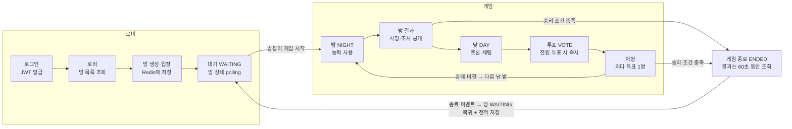

# 게임 로직 · 로비 연동 작업 정리

2026년 10월 1일 · 원우

## 요약

방에서 게임을 시작해 끝나면 같은 방으로 돌아오는 흐름이 서버에서 하나로 연결됐습니다. 게임 API도 이제 로그인 토큰(JWT)으로 플레이어를 식별합니다. 코드를 읽으며 흐름을 검증했고, 실제 빌드·실행 확인은 각자 로컬에서 Postman 시나리오 C로 확인 가능합니다.

## 전체 흐름

승리 조건은 밤 결과 직후와 처형 직후에 서버가 검사하고, 승패가 나지 않으면 다음 날 밤으로 돌아갑니다.

## API 목록

`/api/v1/**`는 모두 `Authorization: Bearer {accessToken}`이 필요합니다.

| 흐름 | 메서드 · 경로 | 비고 |
| --- | --- | --- |
| 회원가입 | `POST /api/members/signup` | 토큰 불필요 |
| 로그인 | `POST /api/members/login` | `accessToken`, `userId` 반환 |
| 방 목록 | `GET /api/v1/rooms` | status, gameId 포함 |
| 방 생성 | `POST /api/v1/rooms` | body `{title, maxPlayers}`, 인원 4~12, 방장 자동 입장 |
| 방 상세 | `GET /api/v1/rooms/{roomId}` | 새로 추가. 대기 화면 polling용 |
| 방 입장 | `POST /api/v1/rooms/{roomId}/players` | 게임 중·정원 초과·중복이면 409 |
| 참가자 목록 | `GET /api/v1/rooms/{roomId}/players` |  |
| 방 나가기 | `DELETE /api/v1/rooms/{roomId}/players/me` | 마지막 사람이면 방 삭제, 게임 중이면 409 |
| 게임 시작 | `POST /api/v1/rooms/{roomId}/games` | 방장만, gameId 반환 |
| 게임 상태 | `GET /api/v1/games/{gameId}` | phase, day, phaseEndsAt, 생존자 |
| 내 역할 | `GET /api/v1/games/{gameId}/me` | 토큰의 본인만 |
| 밤 능력 | `POST /api/v1/games/{gameId}/night-actions` | body `{targetId}`, NIGHT에만 |
| 밤 결과 | `GET /api/v1/games/{gameId}/night-result` | 조사 결과는 선장 본인에게만 |
| 투표 | `POST /api/v1/games/{gameId}/votes` | body `{targetId}`, VOTE에만 |
| 처형 결과 | `GET /api/v1/games/{gameId}/execution-result` |  |
| 게임 결과 | `GET /api/v1/games/{gameId}/result` | 종료 후 60초까지 |
| 직업 목록 | `GET /api/v1/roles` |  |
| (local 전용) 테스트 게임 | `POST /api/v1/games` | 방 없이 게임 생성, prod에는 없음 |

## 흐름별 변경 사항

단계 번호는 작업 계획(1~11단계) 기준입니다. 4단계(준비 API)는 건너뛰어서, 지금은 방장이 준비 없이 바로 시작합니다.

### 인증 (회원가입 · 로그인)

- 로그인 응답의 `accessToken`을 모든 `/api/v1/**` 요청에 `Authorization: Bearer ...`로 보냅니다. 게임 API도 포함입니다.
- 게임 API의 `X-Player-Id` 헤더를 없앴습니다. `CurrentUserResolver`가 토큰의 sub(memberId)로 User를 찾아 userId를 얻고, 이 userId가 게임의 playerId입니다.
- `SecurityConfig`에서 `/api/v1/games/**` permitAll을 지웠습니다. 토큰이 없으면 401이고, 다른 사람의 역할을 보거나 대신 행동할 수 없습니다.
- 회원 모듈 파일에 있던 UTF-8 BOM을 제거했습니다(`illegal character ''` 컴파일 오류). IntelliJ 파일 인코딩은 UTF-8, BOM 없음으로 맞춰 주세요.

### 로비 · 방 (1·2·3단계 + 장애 복구)

- **1단계 · 방 상태:** `Room`에 `status`(WAITING / IN_GAME)와 `gameId`를 추가했습니다. 방 목록·상세 응답에도 두 값이 나옵니다.
- **2단계 · 방별 잠금:** `RoomLockManager`로 같은 방의 입장, 나가기, 게임 시작·종료를 한 번에 하나씩 처리합니다. Redis에서 읽고 고친 뒤 저장하는 사이에 다른 요청이 덮어쓰는 문제를 막습니다. 서버 1대 기준이라, 여러 대로 늘리면 Redis 분산 락으로 바꿔야 합니다.
- **3단계 · 게임 중 제한:** IN_GAME인 방은 입장도, 나가기도 안 됩니다(409).
- **방 상세 API:** `GET /api/v1/rooms/{roomId}`를 추가했습니다. 방장이 아닌 참가자는 이 API로 게임 시작과 gameId를 알아냅니다. polling용이라 잠금 없이 읽습니다.
- **서버 재시작 복구:** 게임은 메모리에 있어 재시작하면 사라지지만, 방은 Redis에 IN_GAME으로 남습니다. 방을 조회하거나 입장·나가기·시작할 때 게임이 없으면 자동으로 WAITING으로 되돌립니다. 참가자 목록은 그대로 두고 준비 상태만 초기화합니다.

### 게임 시작 (5·6단계)

- **5단계:** `GameService.startGame(roomId, participants)`를 서버 내부용으로 분리했습니다. 로비는 방 참가자 목록(`GameParticipant`)만 넘기고, 역할 배정과 첫 밤 진입은 게임 모듈이 합니다.
- **6단계:** 게임 시작 API는 `POST /api/v1/rooms/{roomId}/games`입니다. 방장만 호출할 수 있고, WAITING 상태에 4명 이상이어야 합니다. 게임을 먼저 만들고, 성공했을 때만 방을 IN_GAME으로 바꿉니다.
- 방 없이 게임을 만드는 `POST /api/v1/games`는 `DevGameController`로 옮겨 **local 프로필에서만** 동작합니다. 이 게임은 전적에 반영하지 않습니다.
- 인원 규칙(4~12명)은 `RoleAssigner.MIN_PLAYERS / MAX_PLAYERS` 한 곳에서 가져다 씁니다.

### 게임 진행 (역할 배정 ~ 승리 검사)

- 직업은 DB `roles` 테이블에서 서버 시작 시 한 번 읽어 `RoleCatalog`에 캐시합니다. 해적 테마입니다: 해적(PIRATE_RAIDER), 선장(CREW_CAPTAIN), 선의(CREW_DOCTOR), 선원(CREW_SAILOR).
- 배정: 해적 max(1, 인원/3), 선장 1, 선의 1, 나머지 선원.
- 밤 능력은 직업 이름이 아니라 `ActionCode`로 판정합니다: 공격(SELECT_ATTACK_TARGET), 조사(INVESTIGATE_FACTION), 보호(PROTECT).
- 페이즈 순서는 NIGHT → NIGHT_RESULT → DAY → VOTE → EXECUTION → NIGHT입니다. 시간이 끝나거나 전원이 제출하면 서버가 다음 페이즈로 넘깁니다.
- 승리 검사는 밤 결과 직후와 처형 직후에 서버가 합니다. 해적이 0명이면 CREW 승리, 해적 수가 나머지 이상이면 PIRATE 승리입니다.

### 게임 종료 · 방 복귀 (7·8·10단계)

- **7단계 · 종료 이벤트:** 게임이 끝나면 `GameEndedEvent`(gameId, roomId, 승리 진영, 플레이어별 결과)를 발행합니다. 게임 모듈은 로비나 회원 코드를 직접 부르지 않습니다. 교착 상태를 피하려고 게임 잠금 밖에서 발행합니다.
- **8단계 · 방 복귀:** `RoomGameListener`가 이벤트를 받아 방을 WAITING으로 되돌립니다. gameId를 지우고 준비 상태를 초기화하며, 참가자는 그대로 남습니다.
- **10단계 · 게임 정리:** 끝난 게임은 60초(`mafia.phase.ended-retention-seconds`) 동안 결과를 조회할 수 있고, 그 뒤 메모리에서 지워집니다(이후 404).

### 전적 (9단계)

- `UserStatsListener`가 종료 이벤트를 받아 참가자 전원의 `User.playCount`를 1 올리고, 이긴 진영이면 `winCount`도 올립니다. 한 트랜잭션으로 처리합니다.
- 방에서 시작한 게임만 반영하고, local용 테스트 게임은 반영하지 않습니다. 전적을 조회하는 API는 아직 없습니다.

## 설정 · 인프라

모든 API 경로는 `/api/v1/...`로 통일했습니다. 회원가입·로그인(`/api/members/...`)만 예외입니다.

| 항목 | 내용 |
| --- | --- |
| 프로필 | `application.properties`(공통) + `application-local.properties` / `application-prod.properties`. 기본은 local이고, prod는 `JWT_SECRET`, `DB_URL`, `DB_USER`, `DB_PASSWORD` 환경변수가 반드시 필요합니다. |
| 페이즈 시간 (초) | local: 밤 300 · 밤결과 5 · 낮 5 · 투표 300 · 처형 5 (Postman으로 천천히 테스트하는 용도). prod: 30 · 5 · 60 · 30 · 5 |
| MySQL 8.4 (Docker) | 회원(members), 프로필·전적(users), 직업(roles). `mysql-data` 볼륨에 저장돼 컨테이너를 내려도 유지됩니다(`docker compose down -v`를 쓰면 삭제). |
| Redis 7 (Docker) | 방 정보: `room:{id}`(방 JSON), `rooms`(방 id 목록), `room:id:sequence`(방 번호). 볼륨이 없어 컨테이너를 내리면 사라집니다. |
| 서버 메모리 | 진행 중인 게임(`InMemoryGameRepository`). 서버를 재시작하면 사라집니다. |
| Flyway | 서버가 뜨면 `db/migration`의 V1(테이블), V2(직업 4개), V3(users 재생성)을 순서대로 실행합니다. `ddl-auto=none`이라 스키마 변경은 새 V 파일로만 합니다. **이미 적용된 V 파일은 수정하면 안 됩니다**(checksum 오류). |
| H2 | 테스트 코드(`src/test`)에서만 씁니다. MySQL 모드로 같은 Flyway 파일을 실행합니다. |

IntelliJ에서 Redis를 데이터소스로 볼 때는 Host를 `127.0.0.1`, 인증은 No auth로 두세요. WSL(Ubuntu)을 같이 쓰면 `localhost`가 IPv6 `::1`로 먼저 연결될 수 있습니다.

## Postman으로 확인하기 (11단계)

`postman/mafia-game.postman_collection.json`을 import하고 **0번 폴더부터** 실행하세요. 실제 흐름 검증은 시나리오 C입니다.

| 폴더 | 하는 일 |
| --- | --- |
| 0. 테스트 계정 준비 | tester1~6 가입(이미 있으면 400도 정상) → 로그인 → `p1Id`~`p6Id`와 각자의 토큰 저장 |
| 시나리오 C (방 기반) | 방 생성 → 5명 입장 → 방에서 게임 시작 → 역할 확인 → 밤·투표 2회 → 시민 승리 → 방 WAITING 복귀 확인 → 전원 나가기(방 삭제) |
| 시나리오 A / B | 방 없이 게임 규칙만 빠르게 확인 (local 전용 `POST /api/v1/games`) |
| 오류·규칙 확인 | 페이즈 위반 409, 인원 오류 400, 토큰 없음 401 등 |

- 요청의 `X-Act-As: {{p2Id}}` 헤더는 서버로 가지 않습니다. 컬렉션 스크립트가 그 유저의 Bearer 토큰으로 바꿔서 보냅니다. 헤더가 없으면 tester1 토큰을 씁니다.
- 역할은 무작위라, "역할 확인" 폴더를 모두 실행해야 해적·선장 등의 id 변수가 채워집니다.
- local 기준 밤결과·낮이 각각 5초라, 밤 결과를 확인하고 투표하기 전에 10초쯤 기다려야 합니다. "상태 확인"으로 페이즈를 보면서 진행하세요.
- Redis 값 확인: `docker exec whoisntcitizen-redis redis-cli KEYS "*"`

## Unity 클라이언트 연동 방법

클라이언트는 토큰만 보내고, 상태는 서버에 물어봐서(polling) 화면을 바꿉니다. 승패나 페이즈를 클라이언트가 판단하지 않습니다.

1. 로그인 응답의 `accessToken`과 `userId`를 저장합니다. 이후 모든 요청에 `Authorization: Bearer {accessToken}`을 붙입니다.
2. 대기 화면에서는 `GET /api/v1/rooms/{roomId}`를 1초쯤마다 조회합니다. `status`가 IN_GAME이 되면 `gameId`를 들고 게임 화면으로 갑니다.
3. 게임 화면에 들어가면 `GET /api/v1/games/{gameId}/me`를 한 번 호출합니다. `role`/`roleName`으로 직업을 표시하고, `actionCode`로 밤 능력 UI(공격/조사/보호/없음)를 정하고, 해적이면 `mafiaTeammateIds`로 동료를 표시합니다.
4. 게임 중에는 `GET /api/v1/games/{gameId}`를 주기적으로 조회합니다. `phase`가 바뀌면 화면을 전환하고, `phaseEndsAt`으로 남은 시간을 표시합니다. `phaseVersion`이 올랐는지 보면 변화를 쉽게 알 수 있습니다.
5. NIGHT에는 `POST .../night-actions`, NIGHT_RESULT에는 `GET .../night-result`, VOTE에는 `POST .../votes`, EXECUTION에는 `GET .../execution-result`를 씁니다. body는 `{"targetId": 대상 userId}`입니다.
6. `phase`가 ENDED가 되면 `GET .../result`로 전체 역할과 승리 진영을 보여줍니다. **60초 안에** 조회해야 합니다.
7. 결과 화면 뒤에는 같은 `roomId`의 대기 화면으로 돌아갑니다. 방은 이미 WAITING이라 방장이 바로 다시 시작할 수 있습니다.

에러 응답은 모두 `{code, message}` 형식입니다. 400은 잘못된 입력, 401은 토큰 없음이나 만료(본문 없음, 다시 로그인), 404는 게임 없음, 409는 규칙·상태 충돌입니다.

## 남은 과제 · 팀 확인 필요

아래 1번은 실제 플레이에서 바로 문제가 되니 가장 먼저 고칠 예정입니다.

| # | 문제 | 영향 | 제안 | 담당 |
| --- | --- | --- | --- | --- |
| 1 | 아무도 행동·투표하지 않으면 게임이 끝나지 않음 | 방이 계속 IN_GAME이고 나갈 수도 없음 | 연속 N라운드 사망자 없음 또는 최대 일수 초과 시 무승부 종료 | 게임 |
| 2 | 한 유저가 여러 방에 동시에 참가 가능 | 두 게임에 동시에 참가 | Redis에 `user:{userId}:room`을 두고 방 생성·입장 시 검사 | 로비 |
| 3 | 서버 재시작 후 같은 방에 입장하면 409 "이미 참가 중" | 재접속이 에러처럼 보임 | 이미 참가 중이면 200 + 방 정보 반환, `GET /api/v1/rooms/me` 추가 | 로비 |
| 4 | JWT 만료 1시간, 갱신 없음 | 게임 도중 401 | 만료 시간 늘리기 또는 refresh token | 회원 |
| 5 | 게임 중 이탈한 유저가 방에 남음 | 유령 참가자 | heartbeat 또는 WebSocket 연결 상태로 처리 | 로비 · 게임 |
| 6 | 방 검색은 전체 목록만, 방장이 방을 지우는 API 없음 | 기획과 다를 수 있음 | 제목 검색·WAITING 필터, 방 삭제 API 필요 여부 결정 | 로비 |
| 7 | 준비(ready) API 없음 (4단계 보류) | 방장이 언제든 시작 | 필요하면 준비 토글 + 전원 준비 시에만 시작 | 로비 |
| 8 | 규칙: 해적이 동료 해적 공격 가능, 자기 자신에게 투표 가능, 6명이면 해적 2명 | 밸런스 | 직업 담당과 규칙 확정 | 직업 · 게임 |
| 9 | 전적 조회 API 없음 | 전적은 저장만 됨 | 프로필 조회에 playCount, winCount, 승률 추가 | 회원 |
| 10 | Unity 네트워크 코드 없음 | 실제 플레이 불가 | 위 연동 방법 순서대로 구현 | 클라이언트 |

채팅은 DAY 페이즈에 붙습니다. local의 낮 시간이 5초라, 채팅을 테스트할 때는 `mafia.phase.day-seconds`를 늘려 주세요.
