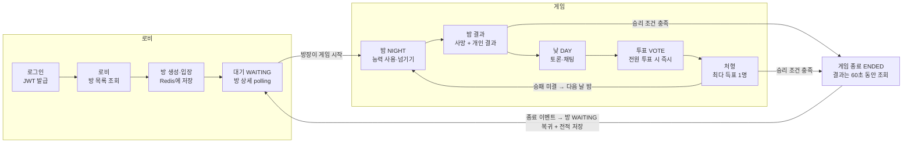

# 게임 로직 · 로비 연동 · 직업 작업 정리

2026년 10월 1일 · 원우 · 기준: `dev` 브랜치 (`3573ef4`, PR #16 jobs 머지 후)

## 요약

방에서 게임을 시작해 끝나면 같은 방으로 돌아오는 흐름이 서버에서 하나로 연결됐습니다. 게임 API는 로그인 토큰(JWT)으로 플레이어를 식별합니다. jobs 머지로 직업이 9종(해적 진영 2, 선원 진영 7)이 됐고, 인원수별 구성표로 배정합니다. 코드를 읽으며 흐름을 검증했고, 실제 빌드·실행 확인은 각자 로컬에서 Postman 시나리오 C(방 흐름)와 D(신규 직업)로 할 수 있습니다.

## 전체 흐름

승리 조건은 밤 결과 직후와 처형 직후에 서버가 검사하고, 승패가 나지 않으면 다음 날 밤으로 돌아갑니다.

## API 목록

`/api/v1/**`는 모두 `Authorization: Bearer {accessToken}`이 필요합니다.

| 흐름 | 메서드 · 경로 | 비고 |
| --- | --- | --- |
| 회원가입 | `POST /api/members/signup` | 토큰 불필요 |
| 로그인 | `POST /api/members/login` | `accessToken`, `userId` 반환 |
| 방 목록 | `GET /api/v1/rooms` | status, gameId 포함 |
| 방 생성 | `POST /api/v1/rooms` | body `{title, maxPlayers}`, 인원 4~12, 방장 자동 입장 |
| 방 상세 | `GET /api/v1/rooms/{roomId}` | 대기 화면 polling용 |
| 방 입장 | `POST /api/v1/rooms/{roomId}/players` | 게임 중·정원 초과·중복이면 409 |
| 참가자 목록 | `GET /api/v1/rooms/{roomId}/players` |  |
| 방 나가기 | `DELETE /api/v1/rooms/{roomId}/players/me` | 마지막 사람이면 방 삭제, 게임 중이면 409 |
| 게임 시작 | `POST /api/v1/rooms/{roomId}/games` | 방장만, gameId 반환 |
| 게임 상태 | `GET /api/v1/games/{gameId}` | phase, day, phaseEndsAt, 생존자 |
| 내 역할 | `GET /api/v1/games/{gameId}/me` | 본인에게 **보이는** 직업, `remainingUses`, `contacted`, 동료 목록 |
| 밤 능력 | `POST /api/v1/games/{gameId}/night-actions` | body `{targetId}`, NIGHT에만. 판정 전 재제출은 덮어쓰기. 응답에 `contactedPirateIds` |
| 밤 능력 넘기기 | `POST /api/v1/games/{gameId}/night-actions/skip` | **신규.** body 없음. 이번 밤 능력을 쓰지 않음 |
| 밤 결과 | `GET /api/v1/games/{gameId}/night-result` | 사망자 공개 + 본인 개인 결과(`reports`) |
| 투표 | `POST /api/v1/games/{gameId}/votes` | body `{targetId}`, VOTE에만 |
| 처형 결과 | `GET /api/v1/games/{gameId}/execution-result` |  |
| 게임 결과 | `GET /api/v1/games/{gameId}/result` | 종료 후 60초까지. 전원의 **실제** 직업 공개 |
| 직업 목록 | `GET /api/v1/roles` | `?faction=CREW` 또는 `PIRATE`로 거르기 |
| (local 전용) 테스트 게임 | `POST /api/v1/games` | 방 없이 게임 생성, prod에는 없음 |
| (local 전용) 실제 직업 조회 | `GET /api/v1/games/{gameId}/dev/roles` | **신규.** 전원의 실제 직업·보이는 직업. Postman 검증용 |

## 직업과 능력

직업 정의는 DB `roles` 테이블(V2 기본 4종 + V4 신규 5종)에 있고, 서버 시작 시 `RoleCatalog`에 캐시됩니다. 능력 규칙은 직업 이름이 아니라 `ActionCode`로 판정합니다.

### 직업 목록

| 코드 | 이름 | 진영 | 능력 (ActionCode) | 대상 | 자기 대상 | 횟수 | 결과 |
| --- | --- | --- | --- | --- | --- | --- | --- |
| `PIRATE_RAIDER` | 해적 | PIRATE | 공격 (`SELECT_ATTACK_TARGET`) | 생존자 | 불가 | 무제한 | 없음 (사망자로 공개) |
| `PIRATE_PARROT` | 앵무새 | PIRATE | 행동 관찰 (`WATCH_ACTION`) | 생존자 | 불가 | 무제한 | 대상이 한 행동 (`ACTIONS`). 해적을 지목하면 접선 |
| `CREW_CAPTAIN` | 선장 | CREW | 진영 조사 (`INVESTIGATE_FACTION`) | 생존자 | 불가 | 무제한 | 대상의 진영 (`FACTION`) |
| `CREW_DOCTOR` | 선의 | CREW | 보호 (`PROTECT`) | 생존자 | 가능 (이틀 연속 불가) | 무제한 | 없음 (`protectedByDoctor`로 공개) |
| `CREW_LOOKOUT` | 망루지기 | CREW | 방문자 감시 (`WATCH_VISITORS`) | 생존자 | 가능 | 무제한 | 대상을 방문한 사람 (`VISITORS`) |
| `CREW_BOATSWAIN` | 갑판장 | CREW | 차단 (`BLOCK`) | 생존자 | 불가 | 무제한 | 없음 |
| `CREW_DRUNK` | 주정뱅이 | CREW | 시체 직업 확인 (`READ_CORPSE_ROLE`) | **사망자만** | 불가 | **게임당 2회** | 시체의 실제 직업 (`CORPSE_ROLE`) |
| `CREW_MONKEY` | 원숭이 | CREW | 없음 (위장 직업의 능력을 씀) | 위장 직업 기준 | 위장 직업 기준 | 위장 직업 기준 | 가짜 결과 |
| `CREW_SAILOR` | 선원 | CREW | 없음 | - | - | - | - |

### 인원수별 구성 (`RoleAssigner.COMPOSITIONS`)

| 인원 | 해적 | 앵무새 | 선장 | 선의 | 망루지기 | 갑판장 | 원숭이 | 주정뱅이 | 선원 |
| --- | --- | --- | --- | --- | --- | --- | --- | --- | --- |
| 4 | 1 |  | 1 | 1 |  |  |  |  | 1 |
| 5 | 1 |  | 1 | 1 |  |  |  |  | 2 |
| 6 | 2 |  | 1 | 1 |  |  |  |  | 2 |
| 7 | 2 |  | 1 | 1 | 1 |  | 1 |  | 1 |
| 8 | 2 |  | 1 | 1 | 1 | 1 | 1 |  | 1 |
| 9 | 2 | 1 | 1 | 1 | 1 | 1 | 1 | 1 |  |
| 10 | 2 | 1 | 1 | 1 | 1 | 1 | 1 | 1 | 1 |
| 11 | 2 | 1 | 1 | 1 | 1 | 1 | 1 | 1 | 2 |
| 12 | 3 | 1 | 1 | 1 | 1 | 1 | 1 | 1 | 2 |

- 4~6인은 기존 구성 그대로라 시나리오 A·B·C가 그대로 동작합니다. 신규 직업은 7인부터 나옵니다.
- 구성표는 서버 시작 시 검증합니다. 인원수와 개수가 맞는지, DB에 있는 직업인지, 공격할 수 있는 해적이 있는지 확인하고, 틀리면 서버가 뜨지 않습니다. 밸런스를 바꿀 때는 이 표만 고치면 됩니다.
- 배정 후 순서를 섞습니다. 원숭이는 배정할 때 위장 직업이 한 번 정해지고 게임 끝까지 바뀌지 않습니다.

### 직업별 상세 규칙

**해적**
- 해적끼리는 처음부터 서로 압니다 (`/me`의 `mafiaTeammateIds`).
- 각자 공격 대상을 고르고, 가장 많이 지목된 사람이 대상이 됩니다(동률이면 무작위).
- 그 대상에게 표를 준 해적 중 무작위 1명만 "방문한 사람"으로 기록됩니다. 망루지기·앵무새에게는 이 1명만 보입니다.
- 동료 해적이나 앵무새도 지목할 수 있습니다.

**앵무새**
- 해적 진영이지만 처음에는 해적이 누구인지 모르고, 해적도 앵무새를 모릅니다.
- **접선:** 살아 있는 해적을 지목하면 **제출하는 즉시** 접선합니다.
  - 응답의 `contactedPirateIds`로 해적 목록을 알게 됩니다.
  - 이후 해적과 앵무새가 서로의 `mafiaTeammateIds`에 보입니다.
  - 접선한 그 밤에는 행동이 고정돼, 다시 제출하거나 넘기면 409입니다.
  - 해적 쪽에서 표를 바꿀 수 있도록, 접선 제출로는 밤이 일찍 끝나지 않습니다.
  - 해적을 지목한 밤에는 개인 결과가 없습니다. 접선 후에 해적을 다시 지목해도 결과가 없습니다.
- **관찰:** 해적이 아닌 사람을 지목하면, 그 사람이 그날 밤 한 행동(능력 + 대상)을 봅니다. 차단당해 무효가 된 행동은 보이지 않습니다.
- 접선은 판정 전에 일어나서 갑판장이 막을 수 없습니다. 관찰 결과는 차단당하면 없습니다.

**선장**
- 대상의 진영(`CREW` / `PIRATE`)을 봅니다.
- 앵무새는 `PIRATE`, 원숭이는 `CREW`로 나옵니다(실제 직업 기준).

**선의**
- 보호한 사람이 공격 대상이면 살고, 밤 결과의 `protectedByDoctor`가 true가 됩니다.
- 자기 자신도 보호할 수 있지만 **이틀 연속은 안 됩니다**(409).

**망루지기**
- 대상을 그날 밤 방문한 사람 목록을 봅니다. 본인과 대상 자신의 행동(예: 선의의 자기 보호)은 빠집니다.
- 해적의 공격은 실행한 해적 1명만 방문으로 칩니다. 원숭이의 행동도 방문으로 보입니다. 차단당한 행동은 방문이 아닙니다.

**갑판장**
- 대상의 그날 밤 행동을 무효로 합니다.
- 차단은 서로 동시에 적용됩니다. 갑판장 둘이 서로 막아도 둘 다 적용되고, 차단 행동 자체는 막히지 않습니다.
- 차단당한 행동은 효과도, 결과도, 방문 기록도 없고 사용 횟수도 차감되지 않습니다.
- 해적이 차단당하면 그 해적의 표가 빠집니다. 공격한 해적이 모두 막히면 그날 밤 아무도 죽지 않습니다.

**주정뱅이**
- 사망자만 대상으로 하며, 시체의 **실제 직업**(원숭이면 `CREW_MONKEY`)을 봅니다.
- 게임당 2회이고, 남은 횟수는 `/me`의 `remainingUses`로 보입니다.
- 사망자가 없는 밤(첫날 등)에는 능력을 쓸 수 없어서, 그 밤의 "전원 제출" 계산에서 빠집니다.

**원숭이**
- 자신이 원숭이인 줄 모릅니다. `/me`에는 선장·선의·망루지기·갑판장·주정뱅이 중 하나로 보입니다.
- 위장 직업의 능력을 제출할 수 있지만 **효과가 없습니다**: 보호도 차단도 조사도 실제로 일어나지 않습니다.
- 들키지 않도록 진짜와 똑같이 처리되는 부분이 있습니다.
  - 방문 흔적이 남습니다.
  - 사용 횟수가 차감됩니다.
  - 위장 직업 형식의 **가짜 결과**를 받습니다.

  | 위장 직업 | 가짜 결과 |
  | --- | --- |
  | 선장 | 무작위 진영 |
  | 망루지기 | 무작위 방문자 0~2명 |
  | 주정뱅이 | 이번 게임에 배정된 직업 중 무작위 |
  | 선의·갑판장 | 없음 (진짜도 결과가 없음) |

- 차단당하면 진짜처럼 가짜 결과도 받지 않습니다.
- 다른 사람의 조사·주정뱅이·게임 결과에는 실제 직업(원숭이, CREW)으로 나옵니다.
- 위장 직업이 실제로 있는 직업과 겹칠 수 있어서, 같은 직업이 둘로 보일 수 있습니다.

### 밤 판정 순서

제출 순서와 관계없이 밤이 끝날 때 `NightActionResolver`가 아래 순서로 한 번에 판정합니다.

1. **차단:** 갑판장의 차단 대상을 모읍니다(원숭이의 위장 차단은 제외).
2. **차단 적용:** 차단당한 사람의 행동을 뺍니다(차단 행동 자체는 남김).
3. **방문 기록:** 남은 행동을 방문으로 기록합니다. 해적의 공격은 6번에서 실행자 1명만 추가합니다.
4. **유효 행동:** 원숭이의 행동을 뺍니다. 방문 흔적은 3번에 남아 있습니다.
5. **보호:** 선의의 보호 대상을 모읍니다.
6. **공격:** 해적 표를 집계해 대상을 정하고, 보호받지 않았으면 사망 처리합니다.
7. **개인 결과:** 조사·감시·관찰·시체 확인 결과를 행동한 본인에게만 만듭니다. 그 밤에 죽은 행동자도 받습니다.
8. **원숭이 가짜 결과:** 차단당하지 않은 원숭이에게 가짜 결과를 줍니다.
9. **사용 기록:** 횟수를 차감하고 선의의 자기 보호 날짜를 기록합니다. 차단당한 행동은 세지 않고, 같은 밤에 여러 번 바꿔도 1회만 셉니다.

**밤이 일찍 끝나는 조건:** 오늘 밤 능력을 쓸 수 있는 생존자가 모두 제출하거나 넘기면 타이머를 기다리지 않고 판정합니다.
- 능력이 없는 직업은 이 계산에서 빠집니다.
- 횟수를 다 쓴 사람도 빠집니다.
- 시체가 없을 때의 주정뱅이도 빠집니다.

### 정보 공개 범위

| 정보 | 누가 보나 | 어디서 |
| --- | --- | --- |
| 내 직업 | 본인 (원숭이는 위장 직업) | `/me` |
| 해적 동료 목록 | 해적끼리 처음부터, 앵무새와 해적은 접선 후 서로 (사망자 포함) | `/me`의 `mafiaTeammateIds` |
| 접선으로 알게 된 해적 | 접선한 앵무새 | 밤 능력 응답의 `contactedPirateIds` |
| 밤 사망자, 보호 성공 여부 | 전원 | `night-result`의 `killedPlayerId`, `protectedByDoctor` |
| 개인 결과 (조사·감시·관찰·시체 확인) | 행동한 본인만 | `night-result`의 `reports` |
| 전원의 실제 직업 | 게임 종료 후 전원 | `result` |

`reports` 한 건의 형식은 `type`에 따라 채워지는 필드가 다릅니다. Unity `JsonUtility`가 다형성을 지원하지 않아서 한 객체에 nullable 필드를 둡니다.

| type | 채워지는 필드 |
| --- | --- |
| `FACTION` | `targetId`, `targetNickname`, `faction` |
| `CORPSE_ROLE` | `targetId`, `targetNickname`, `roleCode`, `roleName` |
| `VISITORS` | `targetId`, `targetNickname`, `players` (`[{playerId, nickname}]`) |
| `ACTIONS` | `targetId`, `targetNickname`, `actions` (`[{actionCode, targetId, targetNickname}]`) |

### 승리 조건

- 살아 있는 해적 진영(해적 + 앵무새)이 0명이면 **CREW 승리**.
- 살아 있는 해적 진영 수가 나머지 생존자 이상이면 **PIRATE 승리**.
- 앵무새도 해적 진영으로 세기 때문에, 해적이 모두 죽고 앵무새만 남으면 공격할 사람이 없는데도 게임이 계속됩니다. 아래 남은 과제를 참고하세요.

## 흐름별 변경 사항

단계 번호는 작업 계획(1~11단계) 기준입니다. 4단계(준비 API)는 건너뛰어서, 지금은 방장이 준비 없이 바로 시작합니다.

### 인증 (회원가입 · 로그인)

- 로그인 응답의 `accessToken`을 모든 `/api/v1/**` 요청에 `Authorization: Bearer ...`로 보냅니다. 게임 API도 포함입니다.
- 게임 API의 `X-Player-Id` 헤더를 없앴습니다. `CurrentUserResolver`가 토큰의 sub(memberId)로 User를 찾아 userId를 얻고, 이 userId가 게임의 playerId입니다. jobs 머지 때 넘기기 API에 남아 있던 `X-Player-Id`도 JWT로 바꿨습니다(`f94b072`).
- `SecurityConfig`에서 `/api/v1/games/**` permitAll을 지웠습니다. 토큰이 없으면 401이고, 다른 사람의 역할을 보거나 대신 행동할 수 없습니다.
- 회원 모듈 파일에 있던 UTF-8 BOM을 제거했습니다(`illegal character ''` 컴파일 오류). IntelliJ 파일 인코딩은 UTF-8, BOM 없음으로 맞춰 주세요.

### 로비 · 방 (1·2·3단계 + 장애 복구)

- **1단계 · 방 상태:** `Room`에 `status`(WAITING / IN_GAME)와 `gameId`를 추가했습니다. 방 목록·상세 응답에도 두 값이 나옵니다.
- **2단계 · 방별 잠금:** `RoomLockManager`로 같은 방의 입장, 나가기, 게임 시작·종료를 한 번에 하나씩 처리합니다.
  - Redis는 명령 하나(GET, SET)는 원자적으로 실행하지만, "읽기 → 수정 → 저장" 사이에 다른 요청이 끼어들어 덮어쓰는 것(lost update)은 막지 못합니다. 그래서 따로 잠급니다.
  - 서버 1대 기준이라, 여러 대로 늘리면 Redis 분산 락(Redisson 등)으로 바꿔야 합니다.
- **3단계 · 게임 중 제한:** IN_GAME인 방은 입장도, 나가기도 안 됩니다(409).
- **방 상세 API:** `GET /api/v1/rooms/{roomId}`를 추가했습니다. 방장이 아닌 참가자는 이 API로 게임 시작과 gameId를 알아냅니다. polling용이라 잠금 없이 읽습니다.
- **서버 재시작 복구:** 게임은 메모리에 있어 재시작하면 사라지지만, 방은 Redis에 IN_GAME으로 남습니다. 방을 조회하거나 입장·나가기·시작할 때 게임이 없으면 자동으로 WAITING으로 되돌립니다. 참가자 목록은 그대로 두고 준비 상태만 초기화합니다.

### 게임 시작 (5·6단계)

- **5단계:** `GameService.startGame(roomId, participants)`를 서버 내부용으로 분리했습니다. 로비는 방 참가자 목록(`GameParticipant`)만 넘기고, 역할 배정(원숭이 위장 포함)과 첫 밤 진입은 게임 모듈이 합니다.
- **6단계:** 게임 시작 API는 `POST /api/v1/rooms/{roomId}/games`입니다. 방장만 호출할 수 있고, WAITING 상태에 4명 이상이어야 합니다. 게임을 먼저 만들고, 성공했을 때만 방을 IN_GAME으로 바꿉니다.
- 방 없이 게임을 만드는 `POST /api/v1/games`는 `DevGameController`로 옮겨 **local 프로필에서만** 동작합니다. 이 게임은 전적에 반영하지 않습니다.
- 인원 규칙(4~12명)은 `RoleAssigner.MIN_PLAYERS / MAX_PLAYERS` 한 곳에서 가져다 씁니다.

### 게임 진행 (역할 배정 ~ 승리 검사)

- 역할 배정은 위 **인원수별 구성표**를 따릅니다. 능력 규칙은 **직업과 능력** 절에 정리했습니다.
- 페이즈 순서는 NIGHT → NIGHT_RESULT → DAY → VOTE → EXECUTION → NIGHT입니다. 시간이 끝나거나 전원이 제출(또는 넘기기)하면 서버가 다음 페이즈로 넘깁니다.
- 투표는 생존자만 할 수 있고, 재투표는 덮어씁니다. 최다 득표자 1명을 처형하고, 동률이거나 투표가 없으면 처형하지 않습니다.

### 게임 종료 · 방 복귀 (7·8·10단계)

- **7단계 · 종료 이벤트:** 게임이 끝나면 `GameEndedEvent`(gameId, roomId, 승리 진영, 플레이어별 실제 직업·결과)를 발행합니다. 게임 모듈은 로비나 회원 코드를 직접 부르지 않습니다. 교착 상태를 피하려고 게임 잠금 밖에서 발행합니다.
- **8단계 · 방 복귀:** `RoomGameListener`가 이벤트를 받아 방을 WAITING으로 되돌립니다. gameId를 지우고 준비 상태를 초기화하며, 참가자는 그대로 남습니다.
- **10단계 · 게임 정리:** 끝난 게임은 60초(`mafia.phase.ended-retention-seconds`) 동안 결과를 조회할 수 있고, 그 뒤 메모리에서 지워집니다(이후 404).

### 전적 (9단계)

- `UserStatsListener`가 종료 이벤트를 받아 참가자 전원의 `User.playCount`를 1 올리고, 이긴 진영이면 `winCount`도 올립니다. 앵무새는 해적 진영 승리 때, 원숭이는 선원 진영 승리 때 이깁니다. 한 트랜잭션으로 처리합니다.
- 방에서 시작한 게임만 반영하고, local용 테스트 게임은 반영하지 않습니다. 전적을 조회하는 API는 아직 없습니다.

## 설정 · 인프라

모든 API 경로는 `/api/v1/...`로 통일했습니다. 회원가입·로그인(`/api/members/...`)만 예외입니다.

| 항목 | 내용 |
| --- | --- |
| 프로필 | `application.properties`(공통) + `application-local.properties` / `application-prod.properties`. 기본은 local이고, prod는 `JWT_SECRET`, `DB_URL`, `DB_USER`, `DB_PASSWORD` 환경변수가 반드시 필요합니다. |
| 페이즈 시간 (초) | local: 밤 300 · 밤결과 5 · 낮 5 · 투표 300 · 처형 5 (Postman으로 천천히 테스트하는 용도). prod: 30 · 5 · 60 · 30 · 5 |
| MySQL 8.4 (Docker) | 회원(members), 프로필·전적(users), 직업(roles). `mysql-data` 볼륨에 저장돼 컨테이너를 내려도 유지됩니다(`docker compose down -v`를 쓰면 삭제). |
| Redis 7 (Docker) | 방 정보: `room:{id}`(방 JSON), `rooms`(방 id 목록), `room:id:sequence`(방 번호). 볼륨이 없어 컨테이너를 내리면 사라집니다. |
| 서버 메모리 | 진행 중인 게임(`InMemoryGameRepository`). 서버를 재시작하면 사라집니다. |
| Flyway | 서버가 뜨면 `db/migration`의 V1(테이블), V2(기본 직업 4종), V3(users 재생성), **V4(신규 직업 5종)**를 순서대로 실행합니다. `ddl-auto=none`이라 스키마 변경은 새 V 파일로만 합니다. **이미 적용된 V 파일은 수정하면 안 됩니다**(checksum 오류). 직업을 추가할 때도 V5처럼 새 파일로 INSERT 합니다. |
| H2 | 테스트 코드(`src/test`)에서만 씁니다. MySQL 모드로 같은 Flyway 파일을 실행합니다. 직업 능력 단위 테스트(`NightBlockAndWatchTest`, `MonkeyTest`, `ParrotContactTest` 등)가 있습니다. |

IntelliJ에서 Redis를 데이터소스로 볼 때는 Host를 `127.0.0.1`, 인증은 No auth로 두세요. WSL(Ubuntu)을 같이 쓰면 `localhost`가 IPv6 `::1`로 먼저 연결될 수 있습니다.

## Postman으로 확인하기 (11단계)

`postman/mafia-game.postman_collection.json`을 import하고 **0번 폴더부터** 실행하세요. 방 흐름은 시나리오 C, 신규 직업은 시나리오 D로 확인합니다.

| 폴더 | 하는 일 |
| --- | --- |
| 0. 테스트 계정 준비 | tester1~9 가입(이미 있으면 400도 정상) → 로그인 → `p1Id`~`p9Id`와 각자의 토큰 저장 |
| 시나리오 C (방 기반, 6명) | 방 생성 → 5명 입장 → 방에서 게임 시작 → 역할 확인 → 밤·투표 2회 → 시민 승리 → 방 WAITING 복귀 확인 → 전원 나가기(방 삭제) |
| 시나리오 A / B (6명 / 4명) | 방 없이 기본 직업 규칙만 빠르게 확인 (local 전용 `POST /api/v1/games`) |
| 시나리오 D (신규 직업, 9명) | 아래 표 참고 |
| 오류·규칙 확인 | 페이즈 위반 409, 인원 오류 400, 토큰 없음 401 등 |

시나리오 D에서 확인하는 내용입니다.

| 날 | 확인하는 것 |
| --- | --- |
| 1일차 밤 | 앵무새가 해적을 지목해 즉시 접선(이후 재제출·넘기기 409), 접선 전후 `/me` 동료 목록, 주정뱅이는 살아 있는 사람 대상이면 409, 갑판장 자기 대상 409, 갑판장이 선장을 차단해 조사 결과 없음, 망루지기가 원숭이 방문자로 해적 1명을 봄, 원숭이는 위장 직업에 맞는 가짜 결과 |
| 1일차 투표 | 해적1 처형 |
| 2일차 밤 | 선의 이틀 연속 자기 보호 409, 갑판장이 해적2를 차단해 공격 무효(사망자 없음), 주정뱅이가 원숭이 시체에서 `CREW_MONKEY` 확인(남은 횟수 2→1), 선장이 앵무새를 조사해 `PIRATE`, 망루지기가 선장 방문자로 앵무새를 봄, 앵무새가 선장의 행동을 관찰 |
| 2일차 투표 | 해적2 처형. 앵무새가 남아 게임이 계속됨 |
| 3일차 | 전원 넘기기 → 앵무새 처형 → 선원 승리, 결과에서 원숭이가 실제 직업으로 공개 |

- 요청의 `X-Act-As: {{p2Id}}` 헤더는 서버로 가지 않습니다. 컬렉션 스크립트가 그 유저의 Bearer 토큰으로 바꿔서 보냅니다. 헤더가 없으면 tester1 토큰을 씁니다.
- 역할은 무작위라, "역할 확인" 폴더를 모두 실행해야 해적·선장 등의 id 변수가 채워집니다. 시나리오 D는 `/dev/roles`로 실제 직업(원숭이 포함)을 읽어 변수를 채웁니다.
- 원숭이가 주정뱅이로 위장한 경우, 첫날 밤에는 시체가 없어 능력을 쓸 수 없습니다. 그래서 그 요청은 스크립트가 자동으로 건너뜁니다.
- local 기준 밤결과·낮이 각각 5초라, 밤 결과를 확인하고 투표하기 전에 10초쯤 기다려야 합니다. "상태 확인"으로 페이즈를 보면서 진행하세요.
- Redis 값 확인: `docker exec whoisntcitizen-redis redis-cli KEYS "*"`

## Unity 클라이언트 연동 방법

클라이언트는 토큰만 보내고, 상태는 서버에 물어봐서(polling) 화면을 바꿉니다. 승패나 페이즈를 클라이언트가 판단하지 않습니다.

1. 로그인 응답의 `accessToken`과 `userId`를 저장합니다. 이후 모든 요청에 `Authorization: Bearer {accessToken}`을 붙입니다.
2. 대기 화면에서는 `GET /api/v1/rooms/{roomId}`를 1초쯤마다 조회합니다. `status`가 IN_GAME이 되면 `gameId`를 들고 게임 화면으로 갑니다.
3. 게임 화면에 들어가면 `GET /api/v1/games/{gameId}/me`를 호출해 아래처럼 씁니다. 원숭이는 위장 직업이 그대로 내려오므로, 클라이언트는 받은 값을 그대로 보여주면 됩니다.
   - `role`/`roleName`: 직업 표시
   - `actionCode`: 밤 능력 UI 결정 (공격, 조사, 보호, 감시, 차단, 시체 확인, 관찰, 없음)
   - `remainingUses`: 남은 횟수 표시 (-1이면 무제한)
   - `mafiaTeammateIds`: 해적 동료 표시
   - `contacted`: 앵무새의 접선 여부
4. 게임 중에는 `GET /api/v1/games/{gameId}`를 주기적으로 조회합니다. `phase`가 바뀌면 화면을 전환하고, `phaseEndsAt`으로 남은 시간을 표시합니다. `phaseVersion`이 올랐는지 보면 변화를 쉽게 알 수 있습니다.
5. 페이즈별로 아래 API를 씁니다. 능력 요청과 투표의 body는 `{"targetId": 대상 userId}`입니다.

   | 페이즈 | API |
   | --- | --- |
   | NIGHT | `POST .../night-actions` (능력을 쓰지 않으면 `POST .../night-actions/skip`) |
   | NIGHT_RESULT | `GET .../night-result` (`reports`의 `type`에 맞게 개인 결과 표시) |
   | VOTE | `POST .../votes` |
   | EXECUTION | `GET .../execution-result` |

   - 주정뱅이는 사망자만 대상으로 고를 수 있게 하고, 나머지 능력은 생존자만 고를 수 있게 합니다.
   - 앵무새의 능력 응답에 `contactedPirateIds`가 있으면 바로 해적 동료로 표시합니다.
6. `phase`가 ENDED가 되면 `GET .../result`로 전체 실제 직업과 승리 진영을 보여줍니다. **60초 안에** 조회해야 합니다.
7. 결과 화면 뒤에는 같은 `roomId`의 대기 화면으로 돌아갑니다. 방은 이미 WAITING이라 방장이 바로 다시 시작할 수 있습니다.

에러 응답은 `{code, message}` 형식입니다(401만 본문이 없음).
- 400: 잘못된 입력
- 401: 토큰 없음이나 만료 (다시 로그인)
- 404: 게임 없음
- 409: 규칙·상태 충돌
  - 페이즈 위반, 사망자 행동
  - 능력 대상 위반 (자기 대상, 생존·사망 조건)
  - 횟수 소진
  - 이틀 연속 자기 보호
  - 접선 후 행동 변경

## 남은 과제 · 팀 확인 필요

아래 1번과 2번은 실제 플레이에서 게임이 끝나지 않는 문제라 가장 먼저 고칠 예정입니다.

| # | 문제 | 영향 | 제안 | 담당 |
| --- | --- | --- | --- | --- |
| 1 | 아무도 행동·투표하지 않으면 게임이 끝나지 않음 | 방이 계속 IN_GAME이고 나갈 수도 없음 | 연속 N라운드 사망자 없음 또는 최대 일수 초과 시 무승부 종료 | 게임 |
| 2 | 해적이 모두 죽고 앵무새만 남으면 공격할 사람이 없는데 게임이 계속됨 | 투표로 앵무새를 잡을 때까지 진행 | 공격 가능한 해적이 0명이면 CREW 승리로 볼지 결정 (1번 무승부 규칙으로도 해결 가능) | 직업 · 게임 |
| 3 | 한 유저가 여러 방에 동시에 참가 가능 | 두 게임에 동시에 참가 | Redis에 `user:{userId}:room`을 두고 방 생성·입장 시 검사 | 로비 |
| 4 | 서버 재시작 후 같은 방에 입장하면 409 "이미 참가 중" | 재접속이 에러처럼 보임 | 이미 참가 중이면 200 + 방 정보 반환, `GET /api/v1/rooms/me` 추가 | 로비 |
| 5 | JWT 만료 1시간, 갱신 없음 | 게임 도중 401 | 만료 시간 늘리기 또는 refresh token | 회원 |
| 6 | 게임 중 이탈한 유저가 방에 남음 | 유령 참가자 | heartbeat 또는 WebSocket 연결 상태로 처리 | 로비 · 게임 |
| 7 | 방 검색은 전체 목록만, 방장이 방을 지우는 API 없음 | 기획과 다를 수 있음 | 제목 검색·WAITING 필터, 방 삭제 API 필요 여부 결정 | 로비 |
| 8 | 준비(ready) API 없음 (4단계 보류) | 방장이 언제든 시작 | 필요하면 준비 토글 + 전원 준비 시에만 시작 | 로비 |
| 9 | 규칙: 해적이 동료 해적·앵무새 공격 가능, 자기 자신에게 투표 가능 | 밸런스 | 직업 담당과 규칙 확정 | 직업 · 게임 |
| 10 | 해적 채팅 권한 | 앵무새가 접선 전에 해적 채팅을 보면 정체가 드러남 | 채팅 권한은 `isPirate()`가 아니라 `Game.knownPirateAllies()` 기준으로, 접선 시각(`contactedAt`) 이후 기록만 공개 | 채팅 · 게임 |
| 11 | `RoleController` 주석에 `NEUTRAL` 진영이 남아 있음 (`Faction`은 CREW, PIRATE만) | 문서 혼동 | 주석 정리 | 직업 |
| 12 | 전적 조회 API 없음 | 전적은 저장만 됨 | 프로필 조회에 playCount, winCount, 승률 추가 | 회원 |
| 13 | Unity 네트워크 코드 없음 | 실제 플레이 불가 | 위 연동 방법 순서대로 구현 | 클라이언트 |

채팅은 DAY 페이즈에 붙습니다. local의 낮 시간이 5초라, 채팅을 테스트할 때는 `mafia.phase.day-seconds`를 늘려 주세요.
